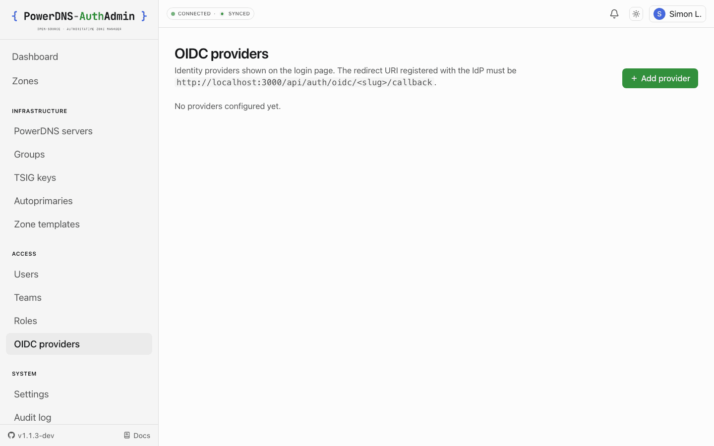

# OIDC single sign-on

PowerDNS-AuthAdmin authenticates users against any standards-compliant OpenID
Connect provider using Authorization Code flow with PKCE. On top of plain
sign-in it can **map IdP groups to roles** (with global / team / zone / server
scope) and do **RP-initiated logout** so signing out ends the session at the IdP,
not just locally.

<picture>
  <source media="(prefers-color-scheme: dark)" srcset="../screenshots/dark/oidc-providers.png" />
  
</picture>

## The three ways to configure OIDC — and how they relate

This is the part that trips people up, so read it once carefully. There are two
_storage_ mechanisms — a **database table** and the **environment** — and they
**coexist**:

```
   DB providers        ┌─────────────────────────────────────────────┐
   (editable)          │  oidc_providers table — the full-featured    │
                       │  path: many providers, group→role mapping,   │
                       │  icons, per-provider options                 │
   written by  ───────►│   • Admin UI:  /admin/oidc-providers         │
                       │   • Provisioning:  the `oidc:` YAML block     │
                       └─────────────────────────────────────────────┘
                              +   (both are shown together)
   env provider        ┌─────────────────────────────────────────────┐
   (read-only)         │  OIDC_* environment variables — ONE provider,│
                       │  badged "Configured by ENV", edited via env. │
                       │  No group→role mapping, no icon.             │
                       └─────────────────────────────────────────────┘
```

**How they coexist:** the env-configured provider is **always offered** — on the
login page _and_ listed (read-only) in **Admin → OIDC providers** with a
**"Configured by ENV"** badge. It is **not** a hidden fallback; it appears
alongside any DB providers. The only interaction is **slug collision**: if a DB
provider has the **same slug** as the env provider, the DB provider **shadows** it
(taking precedence on the login page and in the dispatcher). Otherwise both show
and both work.

|                                                        | Env (`OIDC_*`)                                 | Provisioning (`oidc:` block) | Admin UI               |
| ------------------------------------------------------ | ---------------------------------------------- | ---------------------------- | ---------------------- |
| **Stored in**                                          | environment                                    | `oidc_providers` table       | `oidc_providers` table |
| **Number of providers**                                | exactly one                                    | many                         | many                   |
| **Shown on login page**                                | always (unless a DB provider shadows its slug) | when enabled                 | when enabled           |
| **Editable in the UI**                                 | ❌ read-only — badged "Configured by ENV"      | ✅                           | ✅                     |
| **Group → role mapping**                               | ❌ no                                          | ✅ yes                       | ✅ yes                 |
| **Login-button icon**                                  | ❌ no                                          | ✅ yes                       | ✅ yes                 |
| **Per-provider email-domain / `requireEmailVerified`** | ❌ (env-level only)                            | ✅ yes                       | ✅ yes                 |
| **Changed by**                                         | editing env vars + restart                     | YAML on first boot           | clicking in the UI     |

Provisioning and the Admin UI are the **same mechanism** — both create/edit rows
in `oidc_providers`. Provisioning just populates them once on first boot; after
that the UI is the source of truth. (Provisioning creates + updates by slug and
never deletes.) The env provider is the separate, read-only one.

### Which should I use?

- **Just kicking the tyres / one IdP, no group mapping?** The env path needs no
  database writes — set `OIDC_ENABLED=true` + the five required keys. It shows up
  as a read-only **"Configured by ENV"** provider.
- **Real deployment, want group → role mapping or more than one IdP?** Use DB
  providers — define them in [provisioning](./06-PROVISIONING.md) for reproducible
  installs, or add them in the **Admin UI** for click-ops.
- **Already on env OIDC and want group mapping or to edit it in the UI?** Recreate
  it as a DB provider (UI or provisioning). Using the **same slug** shadows the env
  one and reuses the redirect URI you already registered; you can then drop the
  `OIDC_*` vars at your next restart.

## The redirect (callback) URL

Whatever path you choose, register this redirect URI with your IdP:

```
<APP_URL>/api/auth/oidc/<slug>/callback
```

- `<APP_URL>` is your public URL (e.g. `https://dns.example.com`).
- `<slug>` is the provider's slug — `OIDC_PROVIDER_ID` for the env provider, or
  the provider's `slug` for a DB provider.

Example: `https://dns.example.com/api/auth/oidc/company-sso/callback`.

The sign-in is initiated at `/api/auth/oidc/<slug>/initiate`; the login page links
to it automatically.

## Setup walkthrough (DB provider — the recommended path)

1. **At the IdP**, register a new OIDC/OAuth confidential client:
   - Redirect URI: `<APP_URL>/api/auth/oidc/<slug>/callback`
   - Grant type: Authorization Code (PKCE; the app sends `S256`)
   - Scopes: `openid profile email` (add `groups` if you want group mapping)
   - Note the **issuer URL**, **client ID**, and **client secret**.
2. **In PowerDNS-AuthAdmin**, go to **Admin → OIDC providers → Add provider** and
   fill in slug, name, issuer, client ID/secret, scopes. (Or define the same
   thing in the `oidc:` provisioning block — see [Provisioning](./06-PROVISIONING.md).)
3. **Sign out and sign in** with the new provider button. A brand-new email is
   auto-provisioned as a user with no roles until a group mapping or an admin
   grants one.

## Scopes and claims

- **Scopes** default to `openid profile email`. To use group mapping, request the
  claim that carries groups — commonly `groups` (Keycloak/Authentik) or `roles`,
  and add the matching scope your IdP requires (often `groups`).
- **Claim mapping** lets you point at non-standard claim keys: `claim_email`,
  `claim_name`, and `claim_groups` (default `groups`). Most IdPs need no changes.
- **`requireEmailVerified`** (DB providers only, default **on**): the callback
  rejects a sign-in unless the IdP asserts `email_verified: true`. Relax it only
  for IdPs that never emit the claim (some SAML→OIDC bridges).

## Group → role mapping

DB providers carry a list of group mappings. On **every** successful sign-in, the
user's groups claim is matched against the rules; each match yields a role
assignment tagged to this provider. The next sign-in **revokes** assignments the
user no longer qualifies for — so group membership at the IdP stays the source of
truth. Admin-issued assignments (not tagged to a provider) are never touched.

Each mapping is `group → role @ scope`. Scope syntax:

| Scope              | Applies to                                                     |
| ------------------ | -------------------------------------------------------------- |
| `global`           | everywhere                                                     |
| `team:<slug>`      | the named team                                                 |
| `zone:<zone-name>` | one zone (canonical FQDN, trailing dot — e.g. `corp.example.`) |
| `server:<slug>`    | every zone on one backend                                      |

Example (provisioning YAML — the UI exposes the same fields):

```yaml
group_mappings:
  - { group: pdns-superadmins, role: super-admin, scope: global }
  - { group: noc-zone-editors, role: zone-editor, scope: "team:noc" }
  - { group: corp-zone-readers, role: read-only, scope: "zone:corp.example." }
  - { group: public-dns-only, role: zone-editor, scope: "server:primary-public" }
```

Custom roles work here too — reference them by slug. Mappings whose role/team/
server can't be resolved at sign-in are logged + audited
(`auth.oidc.group_sync.mapping_unresolved`) and skipped; the rest of the sign-in
proceeds. See [Roles & permissions](./07-RBAC.md) for the role catalog.

## Restricting who can sign in

- **`allowed_email_domains`** (DB provider) / **`OIDC_ALLOWED_EMAIL_DOMAINS`**
  (env): an allow-list applied to **new** users' email domains. A first-time
  sign-in for an email outside the list is rejected before any user row is
  created. Existing users keep signing in regardless. Empty/unset = no restriction.
- A user can still be **disabled** in the admin UI to block sign-in entirely,
  regardless of IdP state.

## Convenience options (DB providers)

- **`force_default: true`** — `/login` redirects straight to this provider's
  initiate URL instead of showing the form. Recovery escape hatch:
  `…/login?force-local=1` shows the local form (and any other providers). If
  several providers set `force_default`, the most recent wins.
- **`icon_url`** — an `https://` logo shown on the login button.
- **`enabled: false`** — keep a provider configured but hidden from the login page.

## RP-initiated logout

When an OIDC user signs out, the app uses the IdP's `end_session_endpoint` with an
`id_token_hint` so the session ends at the IdP too — not just locally. No
configuration needed beyond a provider whose discovery doc advertises the
endpoint.

## MFA and SSO users

SSO-only users (no local password) can't enrol local TOTP — the IdP is their
second-factor authority, so the in-app MFA toggle is greyed out for them. If you
want MFA for SSO users, enforce it at the IdP. Local-password users can still
enrol TOTP, and roles can be marked **MFA-required** (see [RBAC](./07-RBAC.md)).

## IdP-specific notes

| IdP                    | Issuer URL                                        | Groups                                                                                 |
| ---------------------- | ------------------------------------------------- | -------------------------------------------------------------------------------------- |
| **Keycloak**           | `https://<host>/realms/<realm>`                   | Add a _Group Membership_ mapper named `groups`; request scope `groups`.                |
| **Authentik**          | `https://<host>/application/o/<slug>/`            | Add a _Groups_ scope mapping; claim `groups`.                                          |
| **Google Workspace**   | `https://accounts.google.com`                     | No groups claim — use it for sign-in; assign roles in-app or by domain.                |
| **Microsoft Entra ID** | `https://login.microsoftonline.com/<tenant>/v2.0` | Add a _groups_ claim (emits group **object IDs** — map those IDs in `group_mappings`). |
| **Okta**               | `https://<org>.okta.com`                          | Add a `groups` claim to the ID token via a claim filter.                               |

For all of them, the redirect URI to register is
`<APP_URL>/api/auth/oidc/<slug>/callback`.

## Troubleshooting

- **`redirect_uri` mismatch** — the URI at the IdP must match
  `<APP_URL>/api/auth/oidc/<slug>/callback` exactly, including scheme and host.
  A wrong `APP_URL` is the usual cause.
- **My env provider isn't showing** — it only hides when a DB provider has the
  **same slug** (which shadows it); otherwise check `OIDC_ENABLED=true` and that
  all five required keys are set. It always appears read-only ("Configured by
  ENV") when configured.
- **Groups aren't mapping to roles** — env providers can't map groups (use a DB
  provider); confirm the IdP actually emits the groups claim and that `claim_groups`
  matches; check the audit log for `mapping_unresolved`.

See [Troubleshooting](./10-TROUBLESHOOTING.md) for more.

---

[← Docs index](./README.md)
