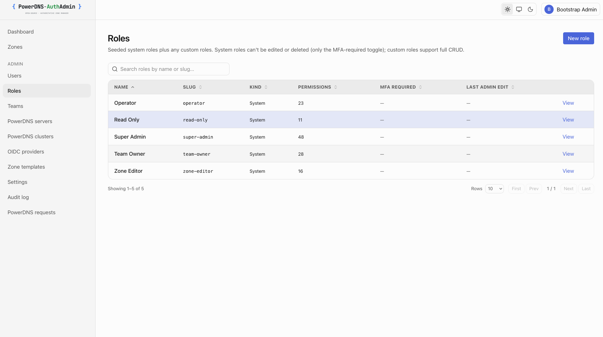

# Roles & permissions (RBAC)

Access is granted by assigning **roles** to users, optionally **scoped** to a
team, zone, or server. A role is a named bundle of permissions; the effective
permission set is the union of a user's assignments that apply in context.

<picture>
  <source media="(prefers-color-scheme: dark)" srcset="../screenshots/dark/roles.png" />
  
</picture>

## The five system roles

Seeded on first boot and protected from deletion. Each builds on the previous —
the description shown here is the one seeded into the `roles.description`
column, surfaced verbatim on the Roles list and detail pages.

| Role            | Seeded description                                                                          | Permissions, in addition to the role above…                                                                                 |
| --------------- | ------------------------------------------------------------------------------------------- | --------------------------------------------------------------------------------------------------------------------------- |
| **Read Only**   | View access to assigned zones. No changes. Useful for auditors and observers.               | View zones, records, DNSSEC, metadata, teams, users, roles, servers, settings; use templates; manage own API tokens (read). |
| **Zone Editor** | Edit records on assigned zones. Cannot create or delete zones.                              | Create/update/delete **records**; create/delete own API tokens.                                                             |
| **Operator**    | Day-to-day zone and record administration within a team. No DNSSEC or member management.    | Create/update/delete/import/export **zones**; write metadata; manage templates.                                             |
| **Team Owner**  | Full control of a team's zones and members. Cannot manage other teams or app-wide settings. | Configure DNSSEC; manage TSIG + autoprimaries; update team + manage members.                                                |
| **Super Admin** | Full access to everything: users, roles, servers, settings, audit.                          | Everything: users, roles, teams, servers, settings, audit, OIDC, all API tokens.                                            |

The seed asserts Super Admin contains every permission, so a new permission added
to the codebase is always held by Super Admin. The seeded descriptions are owned
by `lib/rbac/default-roles.ts`; edits there apply on next boot via `upsertRole`.

Custom roles carry an optional free-text description too — set it on the create
or edit form. It's shown verbatim on the Roles list and detail pages and surfaces
naturally as "what does this role do?" context for newer operators.

## Permission vocabulary

Custom roles are built from these. Names are stable strings (`resource.action`):

| Group            | Permissions                                                                                |
| ---------------- | ------------------------------------------------------------------------------------------ |
| Zones            | `zone.read` `zone.create` `zone.update` `zone.delete` `zone.export` `zone.import`          |
| Records          | `record.read` `record.create` `record.update` `record.delete`                              |
| DNSSEC           | `dnssec.read` `dnssec.configure`                                                           |
| Metadata         | `metadata.read` `metadata.write`                                                           |
| TSIG             | `tsig.read` (list) · `tsig.manage` (create/regenerate/reveal)                              |
| Autoprimary      | `autoprimary.manage`                                                                       |
| Templates        | `template.use` `template.manage`                                                           |
| Users            | `user.read` `user.create` `user.update` `user.delete` `user.disable` `user.reset-password` |
| Teams            | `team.read` `team.create` `team.update` `team.delete` `team.manage-members`                |
| Roles            | `role.read` `role.create` `role.update` `role.delete` `role.assign`                        |
| Servers          | `server.read` `server.create` `server.update` `server.delete`                              |
| API tokens       | `token.read.own` `token.create.own` `token.delete.own` `token.read.all` `token.delete.all` |
| Audit & settings | `audit.read` `settings.read` `settings.write`                                              |
| OIDC             | `oidc.read` `oidc.manage`                                                                  |

## Scopes

A role assignment can apply everywhere or be narrowed:

| Scope              | Applies to                                                              |
| ------------------ | ----------------------------------------------------------------------- |
| `global`           | The whole app.                                                          |
| `team:<slug>`      | Resources owned by the named team.                                      |
| `zone:<zone-name>` | A single zone (canonical FQDN with trailing dot, e.g. `corp.example.`). |
| `server:<slug>`    | Every zone on one backend.                                              |

Example: assign **Zone Editor** scoped to `zone:corp.example.` and the user can
edit records in that one zone and nothing else.

## Assigning roles

- **Admin UI** — assign roles to a user (with a scope) under **Admin → Users**;
  manage role definitions under **Admin → Roles**.
- **OIDC group mapping** — map an IdP group to a role + scope so membership is
  driven by your directory. These assignments are reconciled on every sign-in
  (granted when in the group, revoked when not). See [OIDC](./05-OIDC.md#group--role-mapping).

Admin-issued assignments and OIDC-managed assignments are tracked separately — the
group sync never touches an assignment an admin made by hand.

## Custom roles

Add org-specific roles in the UI (**Admin → Roles**) or in the `roles:`
[provisioning](./06-PROVISIONING.md) block. A custom role is just a slug, a name, and
a list of permissions from the vocabulary above. They can be used anywhere a
system role can, including OIDC group mappings.

```yaml
roles:
  - slug: zone-noc
    name: NOC Zone Operator
    requires_mfa: true
    permissions: [zone.read, record.create, record.update, record.delete, audit.read]
```

## MFA-required roles

A role can be marked **`requires_mfa`**. A user holding such a role must enrol TOTP
before they can act — they're redirected to enrol until they do. SSO-only users
(no local password) are exempt: their IdP is the second-factor authority, so
enforce MFA there. See [OIDC → MFA and SSO users](./05-OIDC.md#mfa-and-sso-users).

---

[← Docs index](./README.md)
