# Features

A complete tour of what PowerDNS-AuthAdmin does, grouped by concern, with module pointers so you
can jump straight into the code that owns each feature.

> **Reading this document.** Each section starts with **what** the feature does, then **where**
> the code lives, then **how** to use / configure it. If you want a quickstart, read the
> [README](../README.md) first.

> **Visual tour.** Every page below is captured in light + dark, desktop + iPhone-framed mobile,
> in [`screenshots/`](../screenshots/README.md). Inline shots in this doc auto-switch theme to
> match your reader; click through for the mobile variant.

---

## 1. Authentication

Operator guides: [OIDC](./05-OIDC.md), [SAML 2.0](./13-SAML.md), [LDAP](./12-LDAP.md),
[Passkeys & security keys](./11-PASSKEYS.md). Every sign-in method ends in the same
`VerifiedIdentity` → `startSession()` path (ADR-0018), so sessions, CSRF, MFA policy and
the audit trail behave identically whichever door the user came through.

### 1.1 Local accounts (email + password)

- **What.** Sign in with email + Argon2id-hashed password. OWASP 2024 parameters. Hashes are
  re-derived (`needsRehash`) on every successful login if the parameter set has been tightened.
- **Where.** `lib/auth/password.ts`, `lib/auth/providers/local.ts`, `app/api/auth/login/route.ts`,
  `app/(auth)/login/`.
- **How.**
  - Bootstrap the first admin via `BOOTSTRAP_ADMIN_EMAIL` + `BOOTSTRAP_ADMIN_PASSWORD` env (see
    `.env.example`). The seed is idempotent - keyed on the email, it ensures that account exists
    and never clobbers an existing one.
  - Add more users from `/admin/users` (gated on `user.create`). The admin can issue a
    one-time temporary password that forces the user to change on first login.
  - Lockout policy is operator-tunable: `login_lockout_threshold` (1–100 attempts) and
    `login_lockout_seconds` (60–86400) on the admin Settings page.
  - The login path is constant-time even when the user doesn't exist - defends against email
    enumeration.

### 1.2 OIDC SSO

- **What.** Generic OIDC (Authorization Code + PKCE) via `openid-client`. Multiple providers
  configurable per install. Discovery happens at sign-in; the AS metadata is cached in-process.
  Auto-detects whether the IdP wants `client_secret_basic` or `client_secret_post`; falls back
  to the other method on `invalid_client` so an IdP whose advertised list disagrees with its
  per-client config still works.
- **Where.** `lib/auth/providers/oidc.ts`, `lib/auth/providers/oidc-probe.ts`,
  `app/api/auth/oidc/[provider]/{initiate,callback}/route.ts`,
  `app/(app)/admin/authentication/` (+ `oidc/[id]/page.tsx`).
- **How.**
  - Add a provider from `/admin/authentication` (gated on `auth.manage`). The
    unified Authentication page lists Local Auth + every configured OIDC, SAML
    and LDAP provider in one table; per-provider edit pages live under
    `/admin/authentication/oidc/<id>` (and `/saml/<id>`, `/ldap/<id>`).
  - The redirect URI to register with the IdP is `${APP_URL}/api/auth/oidc/<slug>/callback`.
  - Slugs are **globally unique across every authentication provider** (OIDC,
    SAML, LDAP) - the `auth_provider_slugs` table enforces this at the DB
    level, so the same slug can't be reused across protocol types.
  - Per-provider toggles:
    - `enabled` - hides the provider from the login page when off.
    - `require_email_verified` - default on; sign-in is blocked unless the IdP attests
      `email_verified: true`. Defends against account-takeover when the same email exists
      locally and the IdP lets users set arbitrary unverified emails. Relax it only for IdPs
      that never emit the claim.
    - `allowed_email_domains` - per-provider override of the env-level allow-list.
  - **Default sign-in method** lives on the unified Authentication page, not
    on individual providers. Pick "Local Auth" or one of the configured
    providers from the dropdown; `/login` auto-redirects on a fresh visit
    (escape hatch: `/login?force-local=1`).
  - Discovery health is operator-pollable via the **Test** button on the providers list AND
    the edit page; the result is cached on the row's `discovery_cache` field.
  - **RP-initiated logout.** When the IdP advertises an `end_session_endpoint`, sign-in
    captures it + the raw id_token on the session row. Logout navigates the browser to
    `<end_session_endpoint>?id_token_hint=…&client_id=…` so the IdP ends its own session and
    renders its signed-out screen. No `post_logout_redirect_uri` is sent - most IdPs require
    it pre-registered and silently strip it otherwise.

<picture>
  <source media="(prefers-color-scheme: dark)" srcset="../screenshots/dark/oidc-providers.png" />
  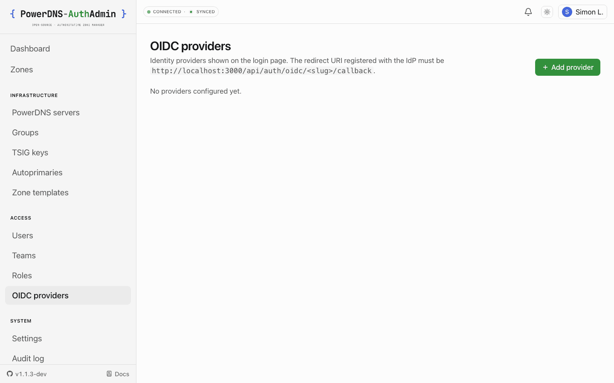
</picture>

### 1.3 Group → role mapping (OIDC / SAML / LDAP)

- **What.** Derive permissions from a user's IdP group claim on every sign-in. The same
  `applyGroupSync` runs for OIDC, SAML and LDAP providers. Since 1.4.0 the result is a
  session-scoped snapshot (`sessions.derived_permissions`) rather than persistent
  `role_assignments` rows, so a user who leaves a group loses the permissions with their
  next sign-in and admin-issued assignments are never touched.
- **Where.** `lib/auth/providers/group-sync.ts` (+ `group-sync-pure.ts`),
  `app/(app)/admin/authentication/oidc/_components/oidc-provider-form.tsx` (the editor; the
  SAML and LDAP forms share the same mapping rows).
- **How.** From a provider's edit page, add rows under **Group → role mappings**: each row pairs
  an IdP group name with a role + scope. Scope syntax is `global`, `team:<slug>`,
  `zone:<fqdn>`, or `server:<slug>`. Mappings whose role/team/server can't be resolved at
  sign-in are logged + audited (`auth.group_sync.mapping_unresolved`, with the provider slug
  in `after.provider`) and skipped - the sign-in still succeeds.

### 1.4 TOTP (multi-factor)

- **What.** Self-service TOTP enrollment for local-password users. Inline SVG QR code rendered
  server-side via `qrcode`; manual setup-key fallback shown alongside. Standard RFC 6238 with
  SHA-1, 30s step, ±1 step skew tolerance, hand-rolled HOTP/Base32 in
  `lib/auth/totp.ts` to avoid an extra dependency.
- **Where.** `lib/auth/totp.ts`, `lib/auth/totp-qr.ts`,
  `app/(app)/profile/_components/totp-section.tsx`, `app/api/profile/mfa/totp/route.ts`,
  `app/api/auth/login/route.ts` (challenge step).
- **How.** From `/profile#mfa`, click **Enable TOTP**, scan the QR with any authenticator app,
  confirm the 6-digit code. Per-role `requires_mfa` enforcement (set on the role edit page)
  redirects non-enrolled users to `/profile?mfa-required=1` until they finish enrolment; either
  TOTP or a passkey / security key (§ 1.8) satisfies it (`lib/auth/mfa-compliance.ts`).
  **SSO-only users** (no local password) see a read-only "Managed by your identity provider"
  panel and are exempt from the `requires_mfa` gate - the IdP is their second-factor authority.

### 1.5 API tokens

- **What.** Per-user `pda_pat_…` tokens with operator-selected permission scopes from the
  user's effective set. Argon2id-hashed at rest, public prefix indexable for lookups.
- **Where.** `lib/auth/tokens.ts`, `lib/db/repositories/api-tokens.ts`,
  `app/(app)/profile/_components/api-tokens-section.tsx`,
  `app/(app)/admin/users/_components/tokens-panel.tsx`,
  `app/api/profile/tokens/`.
- **How.** From `/profile#api-tokens`, **Create token**, pick scopes + optional expiry. The
  plaintext value is shown ONCE and never round-tripped again. Use the token by sending it
  as `Authorization: Bearer pda_pat_…` or `X-API-Key: pda_pat_…`. Admins with `token.read.all`
  see every user's token inventory on the **API tokens** tab of `/admin/users/<id>`. For SSO
  users the token's permissions follow the IdP live - see § 1.13.

### 1.6 Sessions

- **What.** DB-backed sessions (ADR 0007) with encrypted-opaque cookie carrying the row id.
  CSRF via double-submit cookie pair (`csrf_secret` on the row + `csrf` cookie + `x-csrf-token`
  header verified constant-time).
- **Where.** `lib/auth/session.ts`, `lib/auth/csrf.ts`, `lib/db/schema/sessions.ts`.
- **How.** The per-user **Active sessions** panel at `/profile#sessions` lists every browser
  cookie tied to your account with its IP, last-seen timestamp, and a revoke button. Admins
  manage other users' sessions from the **Sessions** tab of `/admin/users/<id>` (gated on
  `user.update`).

### 1.7 Rate limiting

- **What.** Token-bucket per IP for the login + sensitive endpoints. Bounded map size so a
  malicious peer can't OOM the rate-limiter map.
- **Where.** `lib/auth/rate-limit.ts`.
- **How.** Thresholds are compile-time constants in `lib/auth/rate-limit.ts` (`loginLimiter`:
  5 attempts, refill 1/min; `sensitiveLimiter`: 3 attempts, refill 1 per 5 min) - there is no
  env or setting for them. The operator-tunable layer is the per-account lockout
  (`login_lockout_threshold` / `login_lockout_seconds`, § 1.1). Client IP for keys comes
  from the fronting proxy's `X-Forwarded-For`/`X-Real-IP` (`lib/client-ip.ts`); deploy behind a
  proxy that overwrites client-supplied XFF.

### 1.8 Passkeys & security keys (WebAuthn)

- **What.** WebAuthn credentials - platform passkeys (Touch ID, Windows Hello, iCloud Keychain,
  password-manager passkeys) and roaming security keys (YubiKey and friends) - usable two ways:
  **passwordless sign-in** via the "Sign in with passkey" button on `/login`, and as the
  **second factor** after a password (the MFA step offers TOTP or Passkey). Either satisfies a
  role's `requires_mfa`. A user can enrol any number of named credentials and remove them
  individually; an admin can remove a credential from `/admin/users/<id>`, subject to the
  target-privilege ceiling. Ceremonies run through `@simplewebauthn/server`; the RP ID defaults
  to the `APP_URL` hostname and the RP name to the configured site name.
- **Where.** `lib/auth/webauthn/{config,registration,assertion}.ts`,
  `app/api/auth/webauthn/{assertion-options,assertion-verify}/` (sign-in),
  `app/api/profile/mfa/webauthn/{registration-options,registration-verify,[credentialId]}/`
  (enrol / rename / remove), `lib/auth/mfa-compliance.ts` (the `requires_mfa` check). Audit:
  `auth.mfa.webauthn.enrolled|renamed|removed`. Decision record:
  [ADR-0019](./adr/0019-webauthn-passkeys.md).
- **How.** **Profile → Two-factor → Add a passkey.** `WEBAUTHN_*` env knobs (kill-switch, RP
  ID override for apex/sub-domain sharing, user-verification and attestation policy) are in
  [03-CONFIGURATION](./03-CONFIGURATION.md#webauthn--passkeys-optional); the full operator
  guide, including the reverse-proxy notes, is [11-PASSKEYS](./11-PASSKEYS.md).

### 1.9 SAML 2.0 single sign-on

- **What.** A SAML service provider built on `@node-saml/node-saml`. Sign-in builds a signed
  AuthnRequest and redirects via the HTTP-Redirect binding; the IdP POSTs its Response to the
  ACS endpoint, where the signature is verified against the stored IdP certificate (optionally
  requiring a signed Response as well as a signed Assertion), encrypted assertions are
  decrypted with the SP encryption key, and the attributes are mapped to a `VerifiedIdentity`.
  SP metadata is served per provider for one-click IdP registration; single logout is
  supported. Per-provider `allowed_email_domains` and group → role mappings run through the
  shared group sync (§ 1.3). SP private keys are encrypted at rest and never returned by the
  API.
- **Where.** `lib/auth/providers/saml.ts`,
  `app/api/auth/saml/[slug]/{login,acs,metadata,slo}/`,
  `app/(app)/admin/authentication/saml/`, `lib/db/schema/saml-providers.ts`,
  `lib/validators/saml-providers.ts`, the `saml:` provisioning block. Audit:
  `saml.provider.created|updated|deleted`; sign-ins reuse `auth.login.success|failure` with
  `after.method: "saml"` and `after.provider`. Decision record:
  [ADR-0021](./adr/0021-saml-architecture.md).
- **How.** Generate the SP keypair, add the provider under **Admin → Authentication → Add
  provider → SAML**, register `<APP_URL>/api/auth/saml/<slug>/acs` (or the metadata URL) at the
  IdP. Worked examples for Authentik, Keycloak and AD FS in [13-SAML](./13-SAML.md).

### 1.10 LDAP sign-in (Active Directory / OpenLDAP)

- **What.** Direct bind-then-search-then-rebind against an existing directory: bind as a
  service account, find the user with an operator-configured filter (`{{username}}`
  substituted with RFC 4515 escaping), bind again as the user to check the password, then
  resolve groups from a `memberOf`-style attribute or a group search. Strict TLS by default -
  `ldaps://` or StartTLS, plain `ldap://` refused unless `LDAP_ALLOW_INSECURE_PORT_389=true`,
  per-provider CA pin. The bind password is encrypted at rest. The login page shows a
  username + password form per enabled LDAP provider; the route applies the same captcha and
  rate limit as local login. Group → role mappings use the shared sync (§ 1.3).
- **Where.** `lib/auth/providers/ldap.ts` (on `ldapts`),
  `app/api/auth/ldap/[slug]/login/route.ts`, `app/(app)/admin/authentication/ldap/`,
  `lib/db/schema/ldap-providers.ts`, `lib/validators/ldap-providers.ts`, the `ldap:`
  provisioning block. Audit: `ldap.provider.created|updated|deleted`; sign-ins reuse
  `auth.login.success|failure` with `after.method: "ldap"`. Decision record:
  [ADR-0020](./adr/0020-ldap-architecture.md).
- **How.** Add the directory under **Admin → Authentication → Add provider → LDAP**. Worked
  Active Directory and OpenLDAP examples, plus the transport env knobs, in
  [12-LDAP](./12-LDAP.md).

### 1.11 Self-service signup, password reset, email verification and email change

- **What.** Four signed-token flows for local accounts, all built so the response never
  reveals whether an email exists:
  - **Signup** (`SIGNUP_ENABLED`, off by default - `/signup` and `POST /api/auth/signup` are
    404 when off). Creates an **unverified** user holding exactly `SIGNUP_DEFAULT_ROLE`
    (the boot guard refuses an admin-equivalent role), enforces
    `SIGNUP_ALLOWED_EMAIL_DOMAINS`, and blocks login until the address is verified.
  - **Forgot password** (`allow_password_reset` setting; local accounts only).
    `POST /api/auth/forgot-password` always answers 200, mints a `pdr_…` token, and
    `/reset-password` consumes it. Single use without a consumed-tokens table: the token's
    `issuedAt` must be newer than the user's `passwordHashUpdatedAt`. Every session is
    revoked on completion.
  - **Email verification.** `pde_…` tokens; `POST /api/auth/email/send-verification`
    (authenticated) and `POST /api/auth/email/verify` (unauthenticated - the token proves
    ownership, and signup users have no session yet), redeemed on `/verify-email`.
  - **Email change.** From `/profile`, with the current password re-entered; the token is
    bound to `(user, new email)` and confirmed on `/change-email`.
  - **Delivery.** Sent by mail when `SMTP_*` is configured (§ 13). Otherwise the link is
    printed once in the server log at warn level and is never stored in the audit log; the
    operator hands it over out-of-band, or uses the admin **Reset password** action on
    `/admin/users/<id>` (one-time temporary password, sessions revoked) instead.
- **Where.** `app/api/auth/{signup,forgot-password,reset-password}/`,
  `app/api/auth/email/{send-verification,verify}/`, `app/api/profile/email/change/` (+
  `confirm/`), `app/(auth)/{signup,reset-password,verify-email}/`,
  `app/(app)/change-email/`, `lib/auth/{password-reset-token,email-verification-token}.ts`,
  `lib/auth/signup-policy.ts` (the boot guard), `lib/email/templates.ts`. Audit:
  `auth.signup.rejected`, `auth.password.reset.{requested,completed,invalid}`,
  `auth.email.verify.{sent,completed,invalid}`, `auth.email.change.{requested,completed,invalid}`.
- **How.** Env and the end-to-end signup flow:
  [03-CONFIGURATION → Self-service signup](./03-CONFIGURATION.md#self-service-signup).

### 1.12 Captcha (Cloudflare Turnstile)

- **What.** Optional bot gate on the credential-bearing POSTs: local login, LDAP login, signup,
  forgot-password and change-password. With `TURNSTILE_SECRET_KEY` set the route requires a
  token and verifies it server-side against Cloudflare's `siteverify` (the token is never
  logged); with `TURNSTILE_SITE_KEY` set the forms render the widget. Set both for a
  public-facing login. The verifier reads no env itself, so each route decides when captcha
  is required.
- **Where.** `lib/auth/captcha.ts`, `components/ui/turnstile-widget.tsx`; the Turnstile script
  is allowed by the per-request CSP nonce (`lib/security/csp.ts`). A missing or failed token
  is audited as `auth.login.failure` with `after.reason: captcha-missing|captcha-failed`.

### 1.13 IdP-derived permissions and API tokens

- **What.** Group-derived permissions live on the session (`sessions.derived_permissions`),
  not in `role_assignments`, so they expire with the session. When an **API token** of an
  OIDC or LDAP user is used, the app re-fetches the user's current groups live - OIDC via the
  encrypted refresh token → userinfo, LDAP via a service-account search - recomputes
  permissions through the same `computeGroupSync` that sign-in uses, and caches the result
  for `IDP_PERMS_CACHE_TTL_SECONDS` (default 60 s). If the live call fails, or for SAML
  (no back-channel), the token falls back to the latest session snapshot for up to
  `TOKEN_IDP_FALLBACK_TTL_SECONDS` (default 24 h); after that it carries admin-issued
  permissions only until the user signs in again. Token scopes still narrow the result.
- **Where.** `lib/auth/providers/idp-perms-recompute.ts`, `lib/auth/providers/idp-perms-cache.ts`,
  `lib/auth/providers/group-sync.ts`, `lib/auth/token-scope-narrowing.ts`. Audit:
  `auth.token.idp_perms_refreshed` (one row per cache miss).

---

## 2. RBAC

### 2.1 Permissions vocabulary

- **What.** A typed list of 54 permission strings spanning every action surface: zones,
  records, SOA, DNSSEC, metadata, TSIG, autoprimaries, templates, users, teams, roles, PDNS
  servers, API tokens, audit, settings, auth providers, system backup.
- **Where.** `lib/rbac/permissions.ts`.
- **How.** Use a permission in a route via `requireUser({ can: "zone.create" })` or in a page
  component via `requireUserForPage({ can: "zone.create" })`. The CASL ability builder
  (`lib/rbac/ability.ts`) enforces it.

### 2.2 System + custom roles

- **What.** Five system roles are seeded (`super-admin`, `team-owner`, `operator`,
  `zone-editor`, `read-only`). Custom roles are operator-defined via `/admin/roles` (gated on
  `role.create`).
- **Where.** `lib/rbac/default-roles.ts`, `lib/db/schema/roles.ts`,
  `app/(app)/admin/roles/`.
- **How.** Each role carries `permissions` (array of strings from the vocab) + `requires_mfa`
  (any user assigned to this role must enrol a second factor - TOTP or a passkey / security
  key - before they can act).

<picture>
  <source media="(prefers-color-scheme: dark)" srcset="../screenshots/dark/roles.png" />
  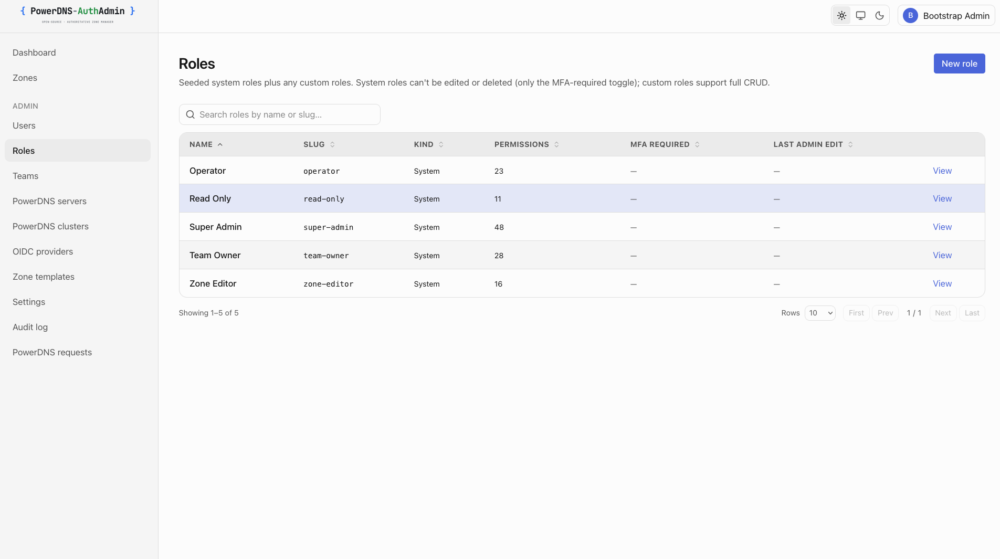
</picture>

### 2.3 Zone-authority permissions

- **What.** The SOA, the apex NS RRset, and the zone-settings object are held apart from
  ordinary record editing, so a role can be given a zone's records without being given the
  zone. `soa.read` / `soa.update` gate the SOA tab; `record.update.apex-ns` is an extra
  requirement on top of `record.*` for writing the apex NS; `zone.settings.read` gates the
  Zone settings tab, whose writes stay on `zone.update`. Missing the read permission removes
  the tab outright rather than greying it out.
- **Where.** `lib/rbac/protected-rrsets.ts` (the classifier both sides share),
  `app/api/admin/pdns/zones/[zoneId]/rrsets/route.ts`,
  `app/api/admin/pdns/zones/[zoneId]/settings/route.ts`,
  `app/(app)/zones/[zoneId]/page.tsx`.
- **How.** The RRset route classifies every change by its normalized name before touching
  PowerDNS, so any client - the SOA panel, the record editor, or a hand-rolled `PATCH` - gets
  the same answer. The permissions work as per-zone grants too. See
  [docs/07-RBAC.md](./07-RBAC.md#splitting-record-editing-from-a-zones-authority).

### 2.4 Scoped assignments

- **What.** Every assignment is `(user, role, scope)` where scope is one of
  `global` / `team:<id>` / `zone:<fqdn>` / `server:<id>`. The CASL builder walks scopes at
  request time so an operator with `record.update` on `zone:example.com.` can edit records
  there but nowhere else. Collection views that accept a scoped grant (e.g. the Teams list
  for a team-scoped Team Owner) opt in with `requireUser({ can, anyInstance: true })` and
  filter every row through an instance check; everything else stays global-only.
- **Where.** `lib/rbac/ability.ts`, `lib/rbac/policy.ts`,
  `lib/db/schema/role-assignments.ts`, `lib/db/schema/zone-grants.ts`.
- **How.** Issue assignments from `/admin/users/<id>` (gated on `role.assign`), or let IdP
  group mapping derive them per session (see § 1.3 and § 1.13). Admin-issued assignments and
  IdP-derived permissions never overwrite each other.

### 2.5 Per-zone grants and the Access tab

- **What.** A `zone_grants` row gives a **user or a team** a list of permissions on exactly one
  `(server, zone)` - no role needed. Team grants flow to every member through `team_members`,
  so removing someone from the team revokes the access without touching per-user rows. On a
  multi-primary cluster a grant on one peer authorizes the zone on every peer, so the
  rotating peer picker never produces a spurious 403. Every zone-scoped permission in the
  vocabulary (records, SOA, apex NS, DNSSEC, metadata, zone settings, export) works as a
  grant, including the authority split from § 2.3. The zone's **Access** tab (gated on
  `user.read`, since it reveals emails and team membership) lists every principal with
  access to the zone: roles that carry any zone-scope permission, teams with grants, and
  users with direct grants.
- **Where.** `lib/db/schema/zone-grants.ts`, `lib/db/repositories/zone-grants.ts`,
  `lib/rbac/zone-permissions.ts` (`canActOnZone`, cluster expansion),
  `app/api/admin/users/[id]/zone-grants/` and `app/api/admin/teams/[id]/zone-grants/` (+
  `[grantId]`), `app/(app)/zones/[zoneId]/_components/access-section.tsx`. Audit:
  `zone.grant.create|delete`.
- **How.** From the **Zone grants** tab on `/admin/users/<id>` (`user.update`) or the
  Zone-grants section on `/admin/teams/<id>` (`team.update` on that team), pick a backend,
  type the zone name (any case,
  with or without the trailing dot - the route canonicalizes it) and tick permissions. The
  grant can't exceed what the issuing operator holds themselves.

---

## 3. PowerDNS backends

### 3.1 Multi-backend management

- **What.** The app fronts one or many PDNS Authoritative servers. Three topologies are
  supported and visible side-by-side:
  - **Standalone primary** - single instance, no replication.
  - **Primary + secondaries** - one writable, N read-only mirrors auto-bootstrapped via
    PDNS supermaster + NOTIFY/AXFR.
  - **Multi-primary cluster** - N writable peers sharing a replicated backend (e.g. Galera
    MariaDB). Cluster appears as ONE entry in every selector.
- **Where.** `lib/db/schema/pdns-servers.ts`, `lib/db/schema/pdns-clusters.ts`,
  `lib/db/repositories/{pdns-servers,pdns-clusters,selectable-backends}.ts`,
  `app/(app)/admin/{servers,clusters}/`.

<picture>
  <source media="(prefers-color-scheme: dark)" srcset="../screenshots/dark/powerdns-servers.png" />
  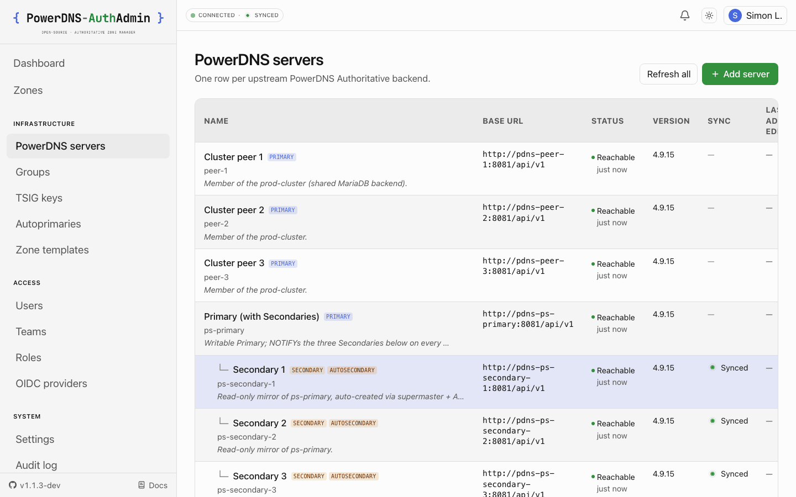
</picture>

### 3.2 Per-cluster peer-selection strategy

- **What.** When operating on a cluster, both reads AND writes route to a peer chosen by the
  cluster's strategy:
  - `round_robin` - spread requests in order.
  - `random` - uniform random.
  - `lowest_latency` - peer with the lowest p50 from the sampler (falls back to round-robin
    until samples exist).
  - `least_load` - peer with the fewest zones from the sampler.
- **Where.** `lib/pdns/cluster-picker.ts`, `lib/pdns/cluster-picker-pure.ts`.
- **How.** Picked from the cluster edit page under **Peer selection strategy**. The column
  in the DB is `write_strategy` (legacy name preserved); the UI label is "Peer selection
  strategy" since it governs both reads and writes.

### 3.3 Read-only backends (write-mode override)

- **What.** A per-backend switch, **Never write to this backend (read-only)**, that removes it
  from every write path while leaving its zones fully browsable. Peer selection skips it, it
  can't be the default backend, and it renders with a `read-only` badge nested under its
  group's write target like a mirror.
- **Why it can't be derived.** Every other role signal in the app is observed from the daemon's
  `/config` (ADR-0014). This one can't be: a public nameserver serving **native** zones fed by
  **database replication** runs with `primary=no, secondary=no` - byte-identical to a standalone
  primary - yet its database user has no write access. PowerDNS exposes no flag for that, so
  without an override the peer picker rotates writes onto it and they fail (#109).
- **Where.** `pdns_servers.write_mode` (`auto` | `read_only`), the `isServerWriteTarget()` /
  `isReadOnlyBackend()` predicates in `lib/pdns/capabilities.ts`, enforced in
  `lib/db/repositories/{pdns-servers,pdns-clusters,selectable-backends}.ts`.
- **How.** Tick the box on the backend's edit page, or set `write_mode: read_only` on a server
  in provisioning YAML. Defaults to `auto`, so existing backends are unaffected.
- **Scope.** The override governs write routing only. AXFR topology derivation still reads the
  daemon's real capabilities, so marking a genuine AXFR primary read-only stops writes to it
  without breaking the secondaries that pull from it. See the 2026-07-22 amendment in
  [ADR-0014](./adr/0014-backend-capability-model.md).

> **Note.** "Use as the default backend" is a _different_ control - it only picks which backend
> serves a request that doesn't name one. It has never constrained peer selection within a group;
> use the read-only switch for that.

### 3.4 Sync probes

- **What.** Two flavours, identical visual shape:
  - **Primary + secondaries.** Compare each secondary's serial against the primary's;
    on-demand rrset diff for any zone that disagrees. Status chip in the zones table.
  - **Cluster.** Compare every peer's serial against the highest-serial peer (used as
    source-of-truth on disagreement, since there's no canonical primary). Same rrset diff
    on demand.
- **Where.** `lib/pdns/sync.ts`, `lib/pdns/cluster-sync.ts`,
  `app/(app)/zones/[zoneId]/_components/sync-section.tsx`.

### 3.5 NOTIFY-on-write + convergence sweep

- **What.** Every code path that creates a zone goes through `createZoneAndNotify()` which
  fires NOTIFY to all secondaries after the create. The provisioning loop additionally runs
  a convergence sweep after all demo zones are created - re-NOTIFYs every Master/Primary
  zone on each touched backend. This catches the docker-compose race where the first zones
  get created before secondaries have registered themselves as supermasters and miss the
  initial NOTIFY.
- **Where.** `lib/pdns/operations.ts`.

### 3.6 PDNS HTTP client

- **What.** Typed thin wrapper over PDNS's HTTP API: zones.list / get / create, rrsets PATCH,
  cryptokeys, metadata, TSIG, autoprimaries, server.info, statistics. Version cache +
  capability flags so feature gates (catalog zones, DNSSEC) reflect the real backend version.
  Retries with backoff, typed error hierarchy (`PdnsError` / `PdnsNotFoundError` /
  `PdnsConflictError`).
- **Where.** `lib/pdns/client.ts`, `lib/pdns/registry.ts`, `lib/pdns/types.ts`,
  `lib/pdns/errors.ts`.

### 3.7 PDNS request log

- **What.** Every HTTP call the app issues to PowerDNS is recorded with timestamp, server,
  operation, method, URL, response status, error (if any), and the correlator `requestId` of
  the audit row that triggered it. Visible at `/admin/requests` with filters for server,
  op, status code, request id, and date range. Each row expands inline to the full request +
  response detail; the `req:` link cross-pivots to / from the matching audit row, so an audit
  failure is one click from the exact PDNS exchange.
- **Where.** `lib/pdns/request-log.ts`, `app/(app)/admin/requests/`,
  `lib/db/repositories/pdns-requests.ts`.

<picture>
  <source media="(prefers-color-scheme: dark)" srcset="../screenshots/dark/pdns-requests.png" />
  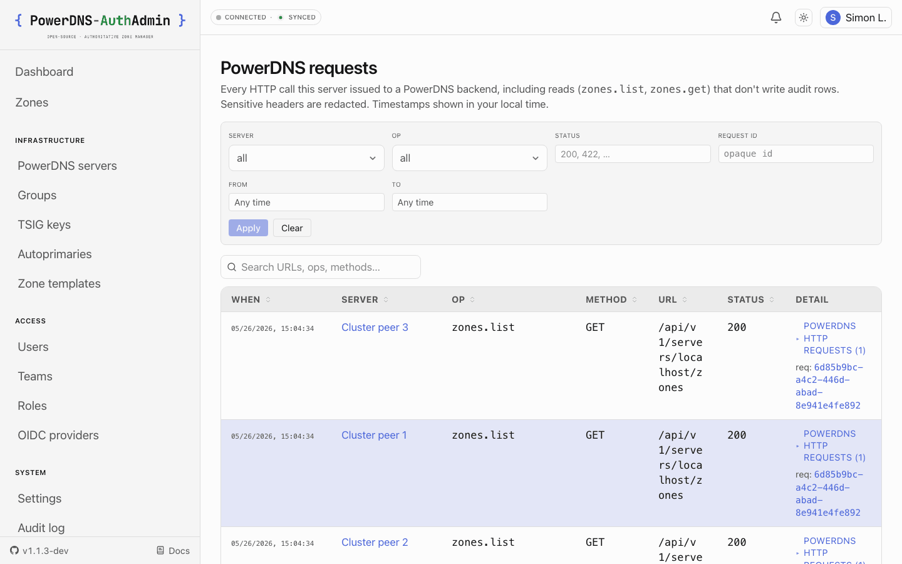
</picture>

### 3.8 Backend health advisories

- **What.** A bell in the top header surfaces active advisories computed every poll cycle:
  unreachable backends, API-key rejections (401/403), replication drift past a threshold, TSIG
  keys missing on a secondary, mirror zones without `masters`, daemon-config drift between
  peers. Acknowledged advisories disappear automatically when the underlying condition
  resolves. Same signal feeds the per-row red/warn tints on
  [PowerDNS servers](#31-multi-backend-management) - bell and table never disagree.
- **Where.** `lib/health/evaluator.ts`, `components/domain/health-bell.tsx`,
  `lib/db/repositories/backend-advisories.ts`. Decision record:
  [ADR-0015](./adr/0015-backend-health-advisories.md).

<picture>
  <source media="(prefers-color-scheme: dark)" srcset="../screenshots/dark/backend-health.png" />
  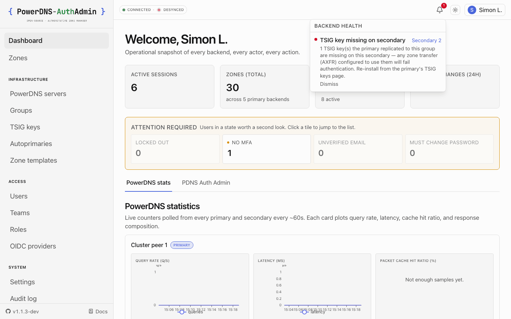
</picture>

### 3.9 SSRF guard

- **What.** Config-time + runtime IP-range checks on PDNS `base_url`. Link-local
  (incl. 169.254.169.254 cloud metadata) is always blocked. Private networks gated by
  `APP_PDNS_ALLOW_PRIVATE_NETWORKS`; `http://` gated by `APP_PDNS_ALLOW_INSECURE_HTTP`.
  At request time the guard re-resolves the host and **pins the validated IP into
  the connection**, so undici reaches the exact address the guard checked (closes
  the DNS-rebinding window).
- **Where.** `lib/pdns/url-safety.ts` (the guard); `lib/pdns/http.ts` (request-time
  re-check + pinned dispatcher).

### 3.10 Observed daemon capabilities

- **What.** Each backend carries a capability snapshot derived from its read-only `/config` on
  every daemon-meta probe: `api`, `primary`, `secondary`, `autosecondary`, the `launch` backends,
  DNSSEC, the configured autoprimary count, and `enable-lua-records`. The active ones render as
  tinted badges wherever a backend is listed; the allowlisted raw settings show verbatim under
  **Daemon settings** on the backend's detail page.
- **Lua records.** `enable-lua-records` (`no` | `yes` | `shared`) is in the snapshot because it
  decides whether the record editor offers the `LUA` type at all. LUA records are executable
  server-side code, so which daemons have it armed has to be visible from the backend list, not
  discoverable only by opening a zone and looking for the type in a dropdown. A daemon-level `no`
  is not a veto: per-zone `ENABLE-LUA-RECORDS` metadata still enables Lua for that one zone.
- **Freshness.** Badges reflect the last probe. After editing `pdns.conf`, re-probe the backend
  (**Admin → PowerDNS servers → Refresh**) - the same gesture that refreshes every other
  capability.
- **Where.** `lib/pdns/capabilities.ts`, `lib/pdns/config-advice.ts`,
  `components/domain/capability-badges.tsx`, `lib/realtime/backend-health.ts`.
  See [ADR-0014](./adr/0014-backend-capability-model.md).

---

## 4. Zones

### 4.1 Amalgamated zones list

- **What.** Every zone across every backend in one list. Per-row "Backend" column. Per-row
  Sync chip: "-" for standalones, "synced/desynced (N)" for primaries with secondaries and
  for clusters.
- **One row per zone identity** - `(horizon, name)`, see § 4.1.1. The same zone reached from a
  primary and its mirrors collapses to one row, resolved to the backend that owns it; anything
  genuinely collapsed is summarized in the "duplicate zones hidden" notice.
- **Where.** `app/(app)/zones/page.tsx`, `app/(app)/zones/_components/zones-table.tsx`,
  `lib/dns/zone-dedupe.ts`.

### 4.1.1 Split-horizon zones (public / internal)

- **What.** A per-zone **horizon** - "this is the internal copy" - set with a toggle at create time
  or later on the zone's **Zone settings** tab. An internal zone lists separately from a public zone
  of the same name, carries an `INTERNAL` badge next to the `CLUSTER` badge, and shows the badge on
  its detail page so it's unambiguous which copy is open before anyone edits a record. A
  Public / Internal filter appears above the list once the fleet has at least one internal zone.
- **Why.** Split-horizon DNS serves the same name differently inside and outside the network,
  usually from two daemons. Before this, the list keyed on the name alone, so the internal copy
  vanished into the "duplicate zones hidden" notice - a deliberate setup reported as an accident of
  replication (#121).
- **How.** App-side classification (PowerDNS cannot tell the two apart), stored sparsely in
  `zone_horizons` and scoped to the backend - to the **cluster** for a cluster zone, so it doesn't
  flicker as peer selection rotates. Unclassified means `public`, so nothing changes for installs
  that don't use it. A mirror of a managed primary inherits that primary's classification. Changes
  are audited as `zone.horizon.update`; deleting a zone drops its classification.
- **Scope.** Presentation and grouping only - it never changes what PowerDNS serves, and it is not
  PDNS 5.0 Views (which splits horizons _within_ one daemon; complementary, not superseded).
- **Where.** `lib/dns/zone-horizon.ts`, `lib/dns/zone-dedupe.ts`,
  `lib/db/{schema,repositories}/zone-horizons.ts`, `components/domain/zone-horizon-badge.tsx`.
  See [ADR-0022](./adr/0022-zone-horizons.md).

<picture>
  <source media="(prefers-color-scheme: dark)" srcset="../screenshots/dark/zones-list.png" />
  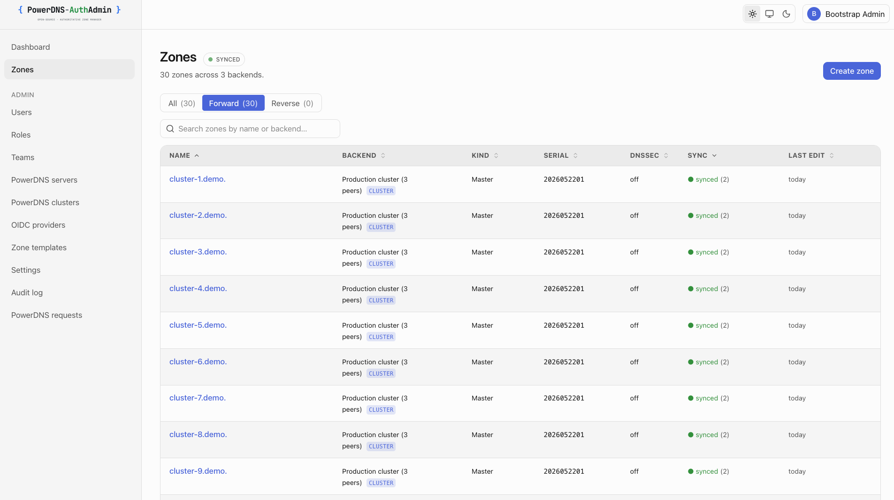
</picture>

### 4.2 Per-RRset editor with diff-before-apply

- **What.** Edit records inline; the editor batches changes into a single transactional PATCH
  to PDNS with an audit row carrying full before/after JSONB snapshots. Every change runs
  through a **Review changes** modal that previews the BIND-style before/after diff - Save is
  the second click, never the first.
- **Default TTL.** A new record starts with the zone's `X-AUTHADMIN-DEFAULT-TTL` metadata if
  set, else the `default_record_ttl` setting, else 3600. The TTL field says which one applied.
  The per-zone value lives in PowerDNS metadata, so it's set from the zone's Metadata tab
  (`metadata.write`, audited) or seeded on new zones by a template's metadata bag
  (`lib/dns/default-ttl.ts`).
- **Where.** `app/(app)/zones/[zoneId]/_components/editable-record-table.tsx`,
  `app/api/admin/pdns/zones/[zoneId]/rrsets/route.ts`.
- **How.** Per-RR-type validators live in `lib/validators/rr-types/` and run on every change
  pair. Hard-error for shape/range violations; soft-warn for deprecated-but-legal options
  (DS digest-type 1, SSHFP DSA, SVCB unknown SvcParamKey, etc.). Hard errors are gated by an
  explicit **Save anyway** checkbox so an override is always intentional and audited verbatim.

<table>
  <tr>
    <td>
      <picture>
        <source media="(prefers-color-scheme: dark)" srcset="../screenshots/dark/zone-edit.png" />
        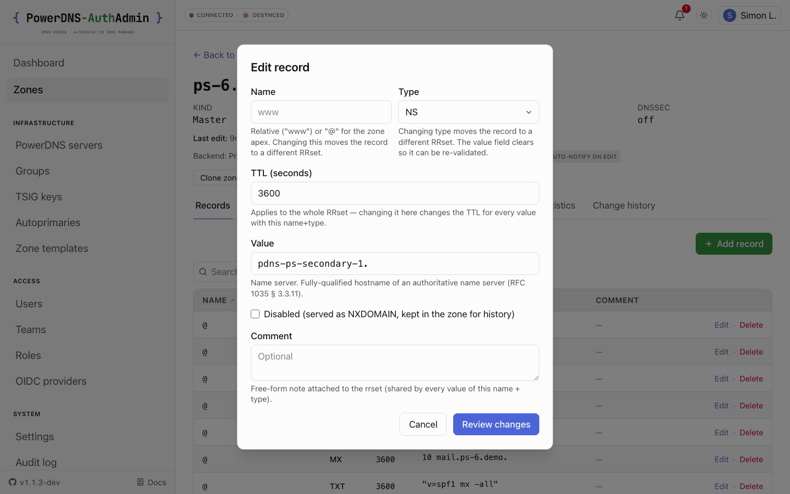
      </picture>
      <br /><sub>Edit dialog - Name / Type / TTL / Value with per-type structured editors.</sub>
    </td>
    <td>
      <picture>
        <source media="(prefers-color-scheme: dark)" srcset="../screenshots/dark/zone-edit-diff.png" />
        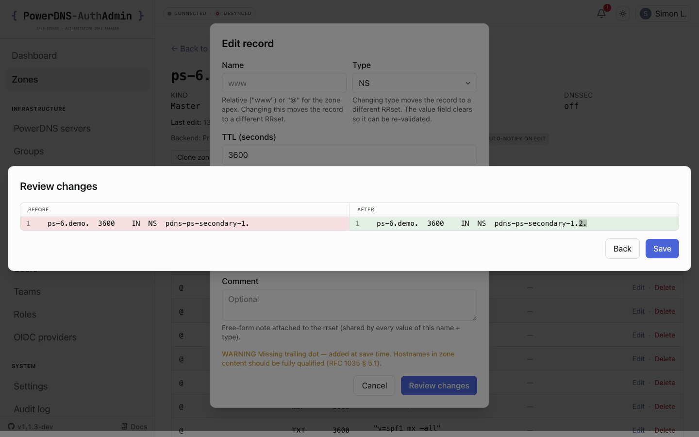
      </picture>
      <br /><sub>Review changes - every save previewed as a before/after diff.</sub>
    </td>
  </tr>
</table>

### 4.3 Zone clone

- **What.** Copy a zone's rrsets into a new zone name on the same backend. The new zone
  ships with the original's records (sans SOA, which PDNS regenerates).
- **Where.** `app/api/admin/pdns/zones/clone/route.ts`, `lib/pdns/clone.ts`.

### 4.4 Zone templates

- **What.** Reusable scaffolding for new zones: NS records, SOA timers, prelude records,
  zone-object settings (`soa_edit`, `soa_edit_api`, `api_rectify`), per-kind metadata bag.
  Templates can be `default_for_primary_slugs` so the create-zone form preselects them when
  the operator picks one of the listed backends.
- **Where.** `lib/db/schema/zone-templates.ts`, `lib/validators/zone-templates.ts`,
  `app/(app)/admin/zone-templates/`.

### 4.5 Zone change history

- **What.** Per-zone history feed at `/zones/<id>?tab=history` rendering every audit event
  with diff (rrset before/after) and one-line summaries for DNSSEC / metadata events. Chip
  colours match the action vocabulary's tone (`lib/audit/action-color.ts`).
- **Where.** `app/(app)/zones/[zoneId]/_components/zone-change-log.tsx`.

<picture>
  <source media="(prefers-color-scheme: dark)" srcset="../screenshots/dark/zone-change-history.png" />
  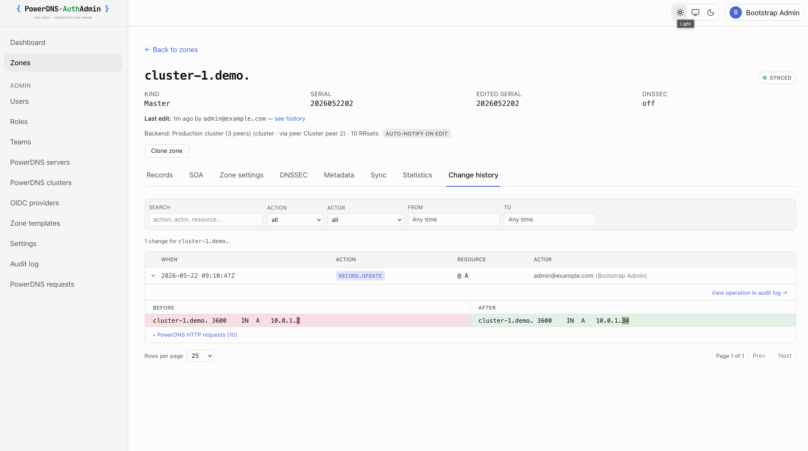
</picture>

### 4.6 Zone import / export (BIND zonefiles)

- **What.** An **Import / Export** hub at `/admin/import-export` (sidebar: PowerDNS → Zones).
  **Import** takes one or many zones in BIND format, pasted or uploaded (2 MiB cap): the
  RFC 1035 parser splits multi-zone input at `$ORIGIN` boundaries, handles `$TTL`, `@`,
  comments and parenthesised multi-line SOAs, refuses `$INCLUDE` (file-traversal vector) and
  skips DNSSEC types (PowerDNS owns those). Each zone becomes one `createZone` call with its
  rrsets pre-populated; failures are reported per zone instead of aborting the batch, and a
  TSIG key can be attached to imported Master zones in the same pass (§ 7). The Lua gate
  (§ 4.7) applies to imported `LUA` records. **Export** picks a backend and any number of
  zones and downloads a single BIND bundle (`$TTL`, `$ORIGIN`, owner names relativised, the
  apex as `@`); the per-zone `GET /api/admin/pdns/zones/[zoneId]/export` returns
  `<zone>.zone` and is what the delete dialog uses to force a backup download first. Output
  round-trips through BIND, NSD and `pdnsutil load-zone`.
- **Where.** `app/(app)/admin/import-export/`, `app/api/admin/pdns/zones/{import,export}/`,
  `app/api/admin/pdns/zones/[zoneId]/export/`, `lib/dns/zonefile-parser.ts`,
  `lib/dns/zonefile-formatter.ts`, `lib/dns/zonefile.ts`. Audit: one `zone.create`
  (`after.source: zonefile-import`) per imported zone, one `zone.export` per exported zone.
- **How.** `zone.read` opens the hub and exports; `zone.create` imports. The `zone.import` /
  `zone.export` permissions in the vocabulary are reserved for finer-grained gating and are
  held by Operator and above.

### 4.7 Lua records

- **What.** The editor offers - and the write path accepts - the PowerDNS `LUA` type only when
  the daemon actually has Lua armed: the global `enable-lua-records` setting **or** the zone's
  `ENABLE-LUA-RECORDS` metadata. The check is re-read live from PowerDNS on every Lua write
  (RRset PATCH and zonefile import alike) and fails closed, so a stale tab or crafted request
  can't land executable records on a server that has Lua off. The content validator checks the
  presentation format (`<query-type> "<snippet>"`, adjacent quoted chunks, `\DDD` escapes,
  the 255-octet boundary) without attempting to parse Lua. Which backends have Lua armed is
  visible from the capability badges (§ 3.10); the DNSSEC tab warns about Lua records on
  replicated signed zones (§ 5).
- **Where.** `lib/pdns/lua-enablement.ts`, `lib/pdns/metadata-policy.ts`,
  `lib/validators/rr-types/lua.ts`.

---

## 5. DNSSEC

- **What.** Zone-level **Enable / Disable DNSSEC** and **Rectify**, plus cryptokey create /
  update / delete with per-key activity timestamps derived from the audit log. Enable does
  PowerDNS' own `PUT /zones/{id}` with `dnssec: true` (default keys + rectify + serial bump),
  sets API-RECTIFY and, for a transferred zone, SOA-EDIT `INCREMENT-WEEKS` so presigned
  secondaries re-transfer fresh signatures weekly, then NOTIFYs. Adding a single key also
  rectifies. Disable is confirm-gated (`confirm=<zone>`) and keeps SOA-EDIT. The tab shows
  signing state, NSEC/NSEC3, SOA-EDIT, the DS set to publish, and warnings (missing SOA-EDIT,
  LUA/ALIAS records on a replicated zone). Status, keys and DS are readable over the API for
  PAT clients. All changes are audited (`dnssec.enable|disable|rectify`,
  `dnssec.cryptokey.*`).
- **Sync semantics.** Mirrors are compared against the primary's **served** serial
  (`edited_serial`), not the stored one, so SOA-EDIT zones don't read as desynced (#146). A
  mirror behind only on the weekly SOA-EDIT rollover is "refresh due" for one SOA refresh. The
  record diff masks the SOA serial and, for signed zones, skips the DNSSEC records a presigned
  mirror stores.
- **Where.** `app/(app)/zones/[zoneId]/_components/dnssec-section.tsx`,
  `app/api/admin/pdns/zones/[zoneId]/{dnssec,rectify,cryptokeys}/`, `lib/pdns/dnssec-plan.ts`,
  `lib/pdns/serial-sync.ts`, `lib/pdns/zone-diff.ts`. Operator guide:
  [04-BACKENDS § DNSSEC](./04-BACKENDS.md#dnssec).

---

## 6. Zone metadata

- **What.** Per-kind GET / PUT / DELETE under `/api/admin/pdns/zones/[zoneId]/metadata/[kind]`.
  Surfaced as `<MetadataEventLine>` entries on the zone change-history feed. AuthAdmin's own
  `X-AUTHADMIN-*` kinds are validated before they're written (`normalizeMetadataValues` in
  `lib/pdns/metadata-policy.ts`).
- **Where.** `app/(app)/zones/[zoneId]/_components/metadata-section.tsx`,
  `app/api/admin/pdns/zones/[zoneId]/metadata/`.

---

## 7. TSIG keys

- **What.** Manage shared-secret keys for AXFR + DDNS. Permission model splits `tsig.read`
  (list-only - name + algorithm) from `tsig.manage` (create / regenerate / reveal / delete)
  so an operator can audit the inventory without ever seeing the secret material.
- **Replication helpers.**
  - **Install on secondaries** - `POST /api/admin/pdns/tsig-keys/[id]/install` fetches the
    key server-side and POSTs it to each of the primary's secondaries over their TSIG API; the
    secret never reaches the browser. Version-gated (`supportsTsigApi`): older daemons report
    `unsupported`, and a key with the same name but a different secret is reported, not
    overwritten. Audit `tsig.install-secondaries`.
  - **Manual install script** - `POST .../manual` returns a copy-paste script
    (`pdnsutil import-tsig-key` + `set-meta`) for daemons without the TSIG API or air-gapped
    boxes. It contains the secret, so it's returned as `text/plain` and audited as
    `tsig.manual-reveal`.
  - **Zone transfer key** - `POST /api/admin/pdns/zones/[zoneId]/tsig-transfer` adds or
    removes a key on both ends at once: `TSIG-ALLOW-AXFR` on the primary's copy and
    `AXFR-MASTER-TSIG` on each secondary that hosts the zone (additive, so other keys stay).
    Gated on `metadata.write` like the raw metadata route; audited as
    `zone.tsig-transfer.set`. The create-zone and import forms expose the same choice - a key
    is selectable only when it exists on the primary and every participating secondary
    (`lib/realtime/tsig-eligibility.ts`).
- **Where.** `lib/pdns/tsig.ts`, `lib/pdns/tsig-install.ts`, `lib/realtime/tsig-replication.ts`,
  `app/api/admin/pdns/tsig-keys/`, `app/(app)/admin/tsig-keys/`.

<picture>
  <source media="(prefers-color-scheme: dark)" srcset="../screenshots/dark/tsig-keys.png" />
  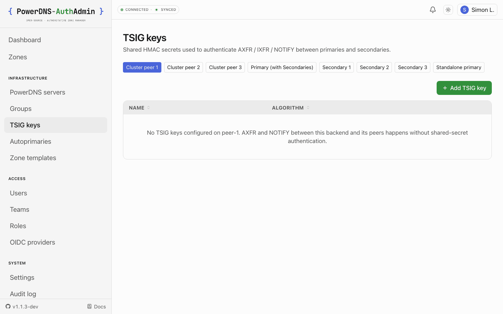
</picture>

---

## 8. Autoprimaries

- **What.** Configure supermaster registrations on a secondary PDNS so it auto-creates zones
  on NOTIFY from a registered primary. Gated on `autoprimary.manage`; audited as
  `autoprimary.create|delete`.
- **Where.** `lib/pdns/types.ts` (autoprimary schemas), `lib/pdns/client.ts`,
  `app/api/admin/pdns/autoprimaries/`, `app/(app)/admin/autoprimaries/`.

<picture>
  <source media="(prefers-color-scheme: dark)" srcset="../screenshots/dark/autoprimaries.png" />
  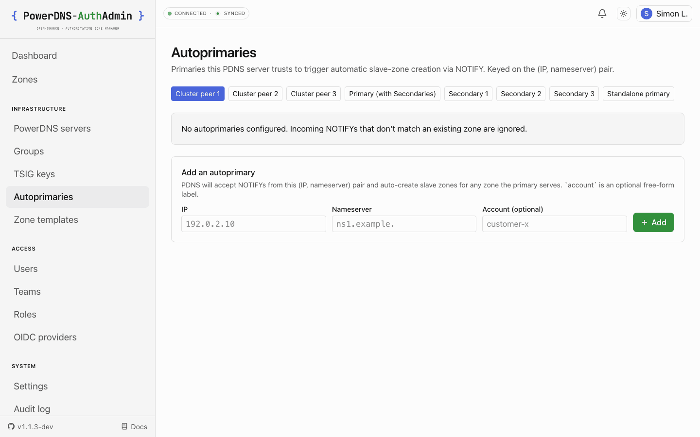
</picture>

---

## 9. Audit log

- **What.** Append-only log of every state-changing operation. Each row carries actor, action,
  resource, optional before/after JSONB snapshots, request context (IP, user-agent, request
  id), and a timestamp. Snapshots are auto-redacted for known secret field names.
- **Where.** `lib/audit/log.ts`, `lib/audit/actions.ts` (typed vocab), `lib/audit/redact.ts`,
  `app/(app)/admin/audit/`.
- **How.** Filter by actor, action, resource, time range from `/admin/audit` (gated on
  `audit.read`). Per-resource "Last admin edit" columns on every admin list page are derived
  from one batched query. Quick-filter chips cover the common incident-response queries
  (failed sign-ins, MFA admin changes, session revocations). Every row that originated a PDNS
  call carries a `req:` link that pivots to the matching rows in
  [the PDNS request log](#37-pdns-request-log), and CSV export honours the active filters.

<picture>
  <source media="(prefers-color-scheme: dark)" srcset="../screenshots/dark/audit-log.png" />
  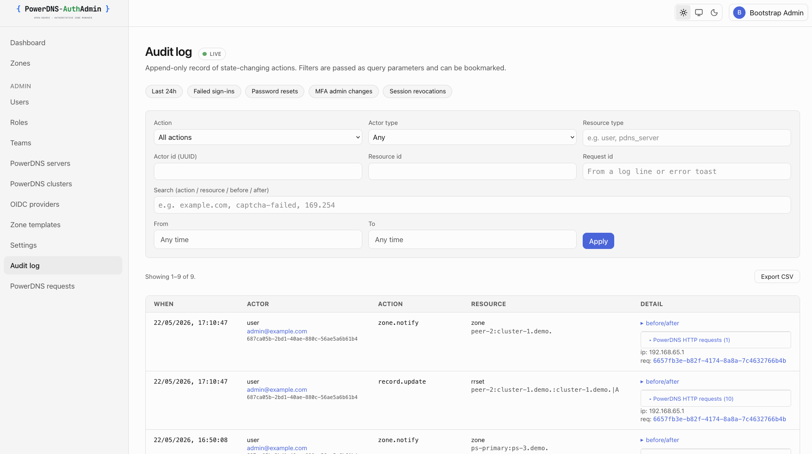
</picture>

### 9.1 Audit action vocabulary

Every row's `action` is one of the strings below (`lib/audit/actions.ts` is the source of
truth; add there first). Names follow `<resource>.<verb>` and line up with the permission
vocabulary where a 1:1 mapping exists. Rows written before a rename keep the old name.

| Action                                                 | Written when                                                                                                                                                    |
| ------------------------------------------------------ | --------------------------------------------------------------------------------------------------------------------------------------------------------------- | -------- | ------------------------------------------------- |
| `auth.login.success`                                   | A sign-in completed (any method; `after.method` is `local`, `oidc`, `saml`, `ldap`, `webauthn-primary` or `webauthn-second-factor`, `after.provider` the slug). |
| `auth.login.failure`                                   | A sign-in was refused - bad credentials, lockout, captcha missing/failed, unverified email, MFA step failed.                                                    |
| `auth.logout`                                          | A session was ended by its owner.                                                                                                                               |
| `auth.password.changed`                                | A user changed their own password.                                                                                                                              |
| `auth.mfa.enrolled`                                    | TOTP enrolled on the actor's own account.                                                                                                                       |
| `auth.mfa.removed`                                     | TOTP removed (self-service, or by an admin - `actor` tells which).                                                                                              |
| `auth.mfa.webauthn.enrolled`                           | A passkey / security key was registered.                                                                                                                        |
| `auth.mfa.webauthn.removed`                            | A passkey / security key was deleted.                                                                                                                           |
| `auth.mfa.webauthn.renamed`                            | A passkey / security key was given a new label.                                                                                                                 |
| `auth.session.revoked`                                 | A user revoked one of their own sessions from `/profile`.                                                                                                       |
| `auth.token.issued`                                    | An API token was created (`after` carries prefix, scopes, expiry - never the secret).                                                                           |
| `auth.token.revoked`                                   | An API token was revoked.                                                                                                                                       |
| `auth.idp.linked`                                      | Reserved in the vocabulary - not emitted today; an SSO first sign-in that provisions a user writes `user.create`.                                               |
| `auth.idp.rejected_provisioning`                       | An SSO sign-in was refused before a user row was created (email domain not allowed, unverified email, disabled account).                                        |
| `auth.signup.rejected`                                 | A self-service signup was refused by the email-domain allow-list (`after` carries the domain only).                                                             |
| `auth.password.reset.requested`                        | A forgot-password request matched a real user and a reset token was minted.                                                                                     |
| `auth.password.reset.completed`                        | A reset token was redeemed and the password replaced (sessions revoked).                                                                                        |
| `auth.password.reset.invalid`                          | A reset token was rejected (expired, already used, bad signature).                                                                                              |
| `auth.email.verify.sent`                               | A verification token was minted for a user.                                                                                                                     |
| `auth.email.verify.completed`                          | An address was verified (`email_verified_at` set).                                                                                                              |
| `auth.email.verify.invalid`                            | A verification token was rejected.                                                                                                                              |
| `auth.email.change.requested`                          | A user asked to move their account to a new address (token bound to the new email).                                                                             |
| `auth.email.change.completed`                          | The new address was confirmed and swapped in.                                                                                                                   |
| `auth.email.change.invalid`                            | An email-change token was rejected.                                                                                                                             |
| `auth.group_sync.mapping_unresolved`                   | A group → role mapping named a role / team / server that no longer exists; the mapping was skipped (`after.provider`).                                          |
| `auth.token.idp_perms_refreshed`                       | An API token triggered a live IdP group re-fetch (one row per `IDP_PERMS_CACHE_TTL_SECONDS` window).                                                            |
| `user.create`                                          | A user was created by an admin, by signup (`after.source: signup`) or by SSO auto-provisioning.                                                                 |
| `user.update`                                          | Profile fields, flags or MFA requirement changed by an admin.                                                                                                   |
| `user.disable`                                         | An account was disabled.                                                                                                                                        |
| `user.enable`                                          | Reserved in the vocabulary - not emitted today; re-enabling is written as `user.update` (the PATCH route only splits out `user.disable`).                       |
| `user.delete`                                          | An account was deleted.                                                                                                                                         |
| `user.password.reset`                                  | An admin issued a temporary password (the reveal is a separate one-time read).                                                                                  |
| `user.session.revoked`                                 | An admin revoked one session of another user.                                                                                                                   |
| `user.sessions.revoked`                                | An admin revoked every session of one user.                                                                                                                     |
| `user.sessions.revoked_all`                            | An admin revoked every session in the system (`/api/admin/sessions`).                                                                                           |
| `team.create` / `team.update` / `team.delete`          | Team lifecycle.                                                                                                                                                 |
| `team.member.added` / `team.member.removed`            | Team membership changed.                                                                                                                                        |
| `role.create` / `role.update` / `role.delete`          | Role lifecycle (permissions, `requires_mfa`, description).                                                                                                      |
| `role.assignment.created` / `role.assignment.deleted`  | A `(user, role, scope)` assignment was issued or removed by an admin.                                                                                           |
| `settings.write`                                       | One or more settings changed on `/admin/settings` (before/after per key).                                                                                       |
| `audit.export`                                         | The audit log was exported as CSV (filters in `after`).                                                                                                         |
| `oidc.provider.created                                 | updated                                                                                                                                                         | deleted` | OIDC provider lifecycle (client secret redacted). |
| `oidc.provider.refresh-all`                            | Operator re-probed discovery for every enabled OIDC provider (one row per click).                                                                               |
| `saml.provider.created                                 | updated                                                                                                                                                         | deleted` | SAML provider lifecycle (SP keys redacted).       |
| `ldap.provider.created                                 | updated                                                                                                                                                         | deleted` | LDAP provider lifecycle (bind password redacted). |
| `pdns_server.refresh-all`                              | Operator re-probed every active backend's version / capabilities (one row per click).                                                                           |
| `backend_advisory.acknowledge`                         | An operator dismissed a health-bell advisory; the condition stays monitored.                                                                                    |
| `zone.create`                                          | A zone was created - UI, API, clone, template, import (`after.source`) or provisioning.                                                                         |
| `zone.update`                                          | Reserved in the vocabulary - not emitted today; zone-object changes are written as `zone.settings.update`.                                                      |
| `zone.delete`                                          | A zone was deleted (and its horizon classification dropped).                                                                                                    |
| `zone.notify`                                          | A NOTIFY was sent to the zone's secondaries (explicit, or as part of a write).                                                                                  |
| `zone.metadata.set` / `zone.metadata.delete`           | A metadata kind was written or removed.                                                                                                                         |
| `zone.settings.update`                                 | Kind, masters, SOA-EDIT(-API) or API-RECTIFY changed on the Zone settings tab.                                                                                  |
| `zone.horizon.update`                                  | A zone was reclassified public ↔ internal (§ 4.1.1).                                                                                                            |
| `zone.grant.create` / `zone.grant.delete`              | A per-zone grant was issued to or removed from a user or team (§ 2.5).                                                                                          |
| `zone.export`                                          | A zone was rendered as a BIND zonefile for download.                                                                                                            |
| `zone.tsig-transfer.set`                               | The zone's AXFR TSIG key was added or removed on primary + secondaries.                                                                                         |
| `dnssec.cryptokey.create                               | update                                                                                                                                                          | delete`  | A cryptokey changed (create also rectifies).      |
| `dnssec.enable` / `dnssec.disable` / `dnssec.rectify`  | Zone-level signing state changed or the zone was rectified (§ 5).                                                                                               |
| `record.create` / `record.update` / `record.delete`    | An RRset changed (before/after snapshots; DynDNS updates are `record.update` with `after.source: dyndns`).                                                      |
| `tsig.create` / `tsig.delete`                          | TSIG key lifecycle.                                                                                                                                             |
| `tsig.reveal`                                          | A key's secret was shown to an operator.                                                                                                                        |
| `tsig.install-secondaries`                             | A key was copied to the primary's secondaries over the TSIG API.                                                                                                |
| `tsig.manual-reveal`                                   | The `pdnsutil` install script (containing the secret) was generated.                                                                                            |
| `autoprimary.create` / `autoprimary.delete`            | Autoprimary (supermaster) registration changed.                                                                                                                 |
| `template.create                                       | update                                                                                                                                                          | delete`  | Zone template lifecycle.                          |
| `server.create` / `server.update` / `server.delete`    | PowerDNS backend lifecycle (API key redacted).                                                                                                                  |
| `server.cluster.assigned` / `server.cluster.removed`   | Reserved in the vocabulary - not emitted today; a group change is a `server.update` whose before/after carries `clusterId`.                                     |
| `cluster.create` / `cluster.update` / `cluster.delete` | Group / cluster lifecycle (peer-selection strategy).                                                                                                            |
| `provisioning.applied`                                 | First-boot provisioning finished (`after` carries per-block counts).                                                                                            |
| `provisioning.skipped`                                 | The file was present but the `provisioned_at` sentinel already existed.                                                                                         |
| `provisioning.failed`                                  | The applier aborted (the boot fails too).                                                                                                                       |
| `system.backup.exported`                               | The app-DB JSON backup was downloaded (`after` carries row counts per table).                                                                                   |
| `system.backup.restored`                               | A backup was merged into the database (`after` carries inserted counts per table).                                                                              |

---

## 10. Settings

- **What.** Operator-tunable runtime values: site name, support contact, login intro text,
  brand logo (https:// URL or inline data: URI), failed-login lockout policy, the
  self-service password-reset toggle (`allow_password_reset`), the default sign-in method
  (`auth_default_provider`, edited from `/admin/authentication`), and the default TTL for
  new records (`default_record_ttl`, overridable per zone - see § 4.2). `SETTINGS_RO=true`
  freezes the whole page (§ 17.1).
- **Where.** `lib/validators/settings.ts`, `app/(app)/admin/settings/`,
  `lib/settings/app-settings.ts`.

<picture>
  <source media="(prefers-color-scheme: dark)" srcset="../screenshots/dark/settings.png" />
  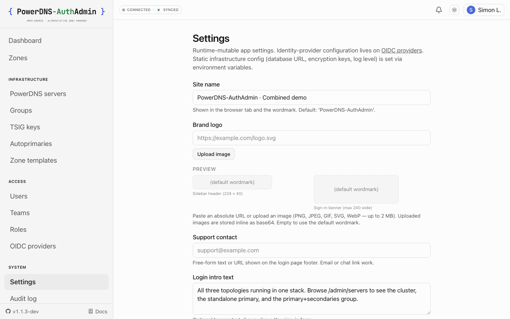
</picture>

### 10.1 Backup & Restore

- **What.** A super-admin wizard at `/admin/settings/backup` (every step inline, with a back
  button). **Export** streams a JSON dump of the app database - users, roles, assignments,
  teams, grants, tokens, providers, backends, clusters, templates, settings, advisories, the
  audit log - as `{ meta, tables }`. It deliberately excludes PowerDNS zone data (the daemon
  owns it) and the symmetric secrets (`APP_SECRET_KEY` / `APP_ENCRYPTION_KEY`, which stay in
  the environment); encrypted columns export as ciphertext, so the file is useless without the
  encryption key and safe to store next to the database. **Restore** is merge-mode only:
  every row is inserted with `ON CONFLICT DO NOTHING` in forward-FK order inside one
  transaction, guarded by a typed `RESTORE` confirmation, so it adds missing rows and never
  overwrites existing ones. The restore target must share the source's
  `APP_ENCRYPTION_KEY`. `SETTINGS_RO=true` blocks both directions (§ 17.1).
- **Where.** `app/(app)/admin/settings/backup/`, `app/api/admin/backup/{export,restore}/`,
  `lib/auth/settings-lock.ts`. Permission: `system.backup`, default-granted only to the seeded
  Super Admin role. Audit: `system.backup.exported|restored` with per-table row counts.
- **How.** For a true wipe-and-restore, or for PowerDNS zone data, use `pg_dump` /
  `sqlite3 .backup` and your PowerDNS backend's own backups - see
  [02-INSTALLATION → Backups](./02-INSTALLATION.md#backups).

---

## 11. Dashboard

- **What.** At-a-glance widgets for operator attention surfaces:
  - **Users** - locked-out, no-MFA, unverified, must-change-password counts.
  - **PDNS backends** - never probed, stale > 24h.
  - **OIDC providers** - never probed, failing discovery.

  Widgets are hidden when zero, so the dashboard stays quiet during steady-state.

- **PowerDNS metrics tab.** With `PDNS_BACKGROUND_POLLING=true`, a second tab charts each
  backend's `/statistics` over time - query rate, latency, cache hit ratio, response
  composition by qtype / rcode / size - from the `pdns_server_stats` time-series the poller
  samples every ~60 s (plus a 5-minute snapshot). Counter metrics are plotted as per-second
  rates, map metrics as donuts. Retention is pruned on the same cadence, bounded to the window
  the dashboard reads. With polling off the tab is hidden and the heading carries an `(i)` hint
  naming the env var.
- **Where.** `app/(app)/dashboard/page.tsx`, `lib/db/repositories/dashboard.ts`,
  `lib/metrics/{pdns-stats-sampler,dashboard-windows,retention}.ts`,
  `components/domain/pdns-stat-chart.tsx`; sampling lives in `lib/realtime/zone-poller.ts`.

<picture>
  <source media="(prefers-color-scheme: dark)" srcset="../screenshots/dark/dashboard.png" />
  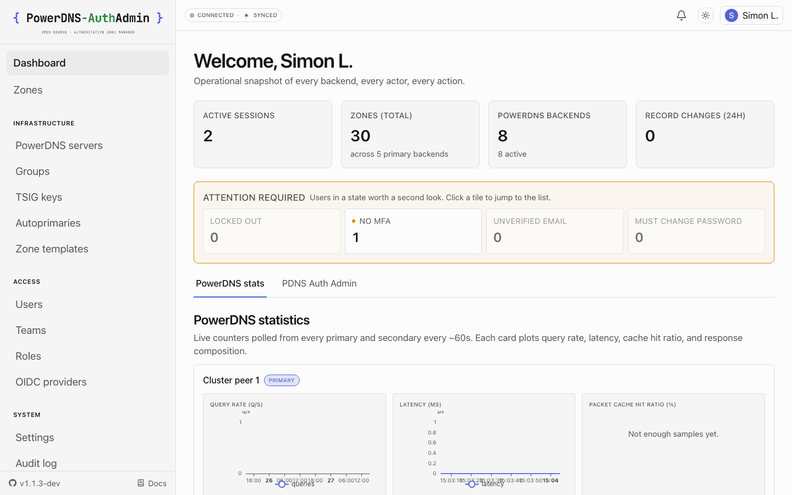
</picture>

---

## 12. Provisioning (first-boot YAML)

- **What.** A YAML file applied on first boot writes the operator's declarative state into the
  database: settings, custom roles, teams, zone templates, PDNS clusters, PDNS servers, OIDC /
  SAML / LDAP providers (each with group mappings), and demo zones - applied in that order.
  Role entries whose slug is a seeded system role are refused rather than overwritten. The
  applier writes a `settings.provisioned_at` sentinel on success; subsequent restarts skip
  the file.
- **Where.** `lib/provisioning/schema.ts` (Zod schema), `lib/provisioning/apply.ts`,
  `provisioning.example.yaml` (exhaustive reference).
- **How.** Set `PROVISIONING_FILE=/etc/.../provisioning.yaml` in the env, drop the file at
  that path, restart. To re-provision an existing database, delete the
  `settings.provisioned_at` row and restart.

---

## 13. Email / SMTP

- **What.** Optional transactional mail. With `SMTP_HOST` unset, `sendEmail()` no-ops with
  `{ ok: true, skipped: true }`; the password-reset, email-verification and email-change
  flows then print their link once in the server log (warn level) and never store it in the
  audit log - an operator reads it from the container logs and hands it over out-of-band,
  or uses the admin **Reset password** action on `/admin/users/<id>` instead. With it set,
  three encryption shapes are supported:
  implicit TLS (`SMTP_SECURE=true`), STARTTLS required, STARTTLS opportunistic (default), or
  plaintext-only for local fakemail. AUTH is optional - omit `SMTP_USERNAME` + `SMTP_PASSWORD`
  for a relay that allow-lists this app's source IP.
- **Where.** `lib/email/transport.ts`, `lib/email/send.ts`, env validation in `lib/env.ts`.

---

## 14. Realtime

- **What.** SSE event bus that the zone list + zone detail subscribe to so external edits show
  up without a manual refresh. Backed by a single in-process zone-state poller; per-request
  PDNS calls are eliminated.
- **Where.** `lib/realtime/event-bus.ts`, `lib/realtime/zone-poller.ts`,
  `lib/pdns/zone-state-cache.ts`.

---

## 15. Observability

- **What.**
  - **Logs.** Pino structured JSON; secret-field redaction via `lib/errors/redact.ts`.
  - **Metrics.** Prometheus `/metrics`, always bearer-gated: `METRICS_TOKEN` (≥ 16 chars) is
    auto-generated and printed once in the boot log if unset. `METRICS_ENABLED=false`
    removes the endpoint. Exposition is hand-built (`lib/metrics/exposition.ts`, metric
    names prefixed `pdnsauthadmin_`).
  - **Health.** `/healthz` (liveness) + `/readyz` (readiness - 200 when the database is
    reachable, 503 otherwise; it does not yet check migration state. Migrations run before
    the server starts listening, so a booted replica has already applied them).
  - **CSP violation reports.** `POST /api/csp-report` receives browser reports in both the
    legacy `report-uri` shape and the Reporting-API shape, logs them at warn level and
    answers 204. Unauthenticated by design (the most interesting violations come from
    visitors who aren't signed in), so it is IP rate-limited and truncates oversized bodies.
    Wired in via the `report-uri` + `report-to` directives the proxy emits.
- **Where.** `lib/logger.ts`, `app/metrics/`, `lib/metrics/`, `app/healthz/`, `app/readyz/`,
  `app/api/csp-report/`, `lib/security/csp.ts`.

---

## 16. Deployment

### 16.1 Single image

- **What.** One Docker image, no external CDN. Migrations run in the entrypoint at boot
  (ADR 0011); on Postgres they're serialized by `pg_advisory_lock` so multi-replica boots are
  safe. `MIGRATE_ON_BOOT=false` opts out for CI/CD-driven migration workflows.
- **Where.** `Dockerfile`, `docker/entrypoint.mjs`, `scripts/migrate.ts`.

### 16.2 Compose stacks

All stacks use the official `powerdns/pdns-auth` image - there is no custom PowerDNS build.

- `docker-compose.yml` - the **minimal-demo stack**: SQLite app (published
  `ghcr.io/powerdns-authadmin/powerdns-authadmin` image) + a bundled standalone PowerDNS, pre-seeded with 10 demo
  zones (via `provisioning.minimal-demo.yaml`). The fastest way to try it.
- `docker-compose-primary-secondaries.yml` - primary + three secondaries with supermaster
  auto-bootstrap.
- `docker-compose-multi-primary.yml` - three writable peers sharing MariaDB.
- `docker-compose-combined.yml` - all three topologies in one stack with seeded demo zones.
- `docker-compose.ha.yml` - Postgres + Redis with three app replicas behind your own load
  balancer; the reference for [running more than one replica](../README.md#high-availability-replicas--1)
  (ADR-0016).

### 16.3 Storage

Postgres (recommended) and SQLite both supported. Schema lives in parallel
`lib/db/schema/` (pg) + `lib/db/schema-sqlite/` directories. Each emits its own migration
folder (`drizzle/`, `drizzle-sqlite/`); the boot entrypoint picks one based on
`DATABASE_URL`'s scheme.

---

## 17. Security posture

- **Per-request CSP nonce** (ADR 0006) so injected `<script>` tags don't execute.
- **CSRF double-submit** on every mutating route via `requireCsrf(request)`.
- **SSRF guard** on PDNS base URLs (§ 3.9).
- **Encryption envelope** for at-rest secrets - versioned AES-256-GCM via HKDF-SHA-256
  subkeys per usage (`lib/crypto/encryption.ts`).
- **Secret-field redaction** in audit `before`/`after` snapshots and free-form log strings.
- **Argon2id** with OWASP 2024 parameters for passwords and API tokens.
- **No telemetry phone-home.** Air-gapped enterprises are first-class.
- **`SECURITY.md`** for the vulnerability disclosure policy.

### 17.1 Public-demo locks (`BOOTSTRAP_ADMIN_RO`, `SETTINGS_RO`)

- **What.** Two env switches for an install whose login is published (the hosted demo). Both
  are pure env flags - no schema column, no migration - and no-ops when off, so real installs
  are unaffected.
  - **`BOOTSTRAP_ADMIN_RO=true`** (requires `BOOTSTRAP_ADMIN_EMAIL`) freezes the bootstrap
    admin's own identity and credentials: password, email, name, TOTP / passkey enrolment,
    disable / delete and role changes all return 403, whether attempted from `/profile` or by
    another admin. Everything else the account can do is untouched - it is an identity lock,
    not a read-only mode. The seed creates the account already compliant
    (`must_change_password=false`) because it can no longer change its password.
  - **`SETTINGS_RO=true`** freezes the whole Settings surface: `PATCH /api/admin/settings`
    returns 403 for everyone, the form renders read-only, and Backup & Restore (§ 10.1) is
    disabled in both directions.
- **Where.** `lib/auth/bootstrap-admin.ts` (`isBootstrapAdminLocked` /
  `assertBootstrapAdminMutable`), `lib/auth/settings-lock.ts` (`isSettingsReadOnly` /
  `assertSettingsMutable` / `assertSettingsBackupAllowed`). Enforcement is at the route
  handlers; the disabled UI affordances only exist to avoid dead-end clicks.

---

## 18. API

- Every admin surface has a corresponding `/api/admin/...` route handler. Routes accept
  either a session cookie (UI clients) or `Authorization: Bearer pda_pat_…` /
  `X-API-Key: pda_pat_…` (API clients).
- Mutating routes require `x-csrf-token`. The client wrapper `lib/client/api-fetch.ts` adds
  it automatically; programmatic clients omit it when authenticating via a PAT (the PAT itself
  proves the request is intentional).
- The full route surface mirrors the admin UI - see `app/api/admin/` and `app/api/profile/`.

### 18.1 DynDNS (`GET /nic/update`)

- **What.** A DynDNS 2 endpoint for routers and `ddclient`-style updaters, so an existing
  dynamic-DNS setup can point at AuthAdmin without a custom script. The client authenticates
  with **HTTP Basic** where the user is the account **email** and the password is one of that
  account's **API tokens** (`pda_pat_…`). The token must carry `record.update`, held either
  globally or through a per-zone grant for the zone the hostname falls under (§ 2.5). The
  route lists the zones of every active backend, picks the **longest matching zone** for the
  hostname (label-anchored, so `evil-example.com` never matches `example.com`) and replaces
  the hostname's `A` or `AAAA` RRset - chosen by the shape of the IP - with TTL 300. The
  update is audited as `record.update` with `after.source: dyndns`.
- **Contract.** As the protocol demands, the response is **always HTTP 200** with a
  `text/plain` body the client parses: `good <ip>` on success, `badauth` (with a Basic
  challenge), `nohost` (no matching zone, or no permission on it), `notfqdn` (missing or
  single-label hostname), `numhost` (comma-separated hostname lists are not supported),
  `dnserr` (PowerDNS refused the write, or no usable IP). `myip` may be an explicit IPv4/IPv6
  address, omitted, or `auto` - the last two use the client's source address as seen through
  the fronting proxy's `X-Forwarded-For` (`lib/client-ip.ts`), so run the usual trusted
  proxy in front.
- **Where.** `app/nic/update/route.ts` (the orchestrator), `lib/dyndns/parse.ts` (pure
  request parsing, response formatting and zone matching; fuzz-tested).
- **How.** Create a token on `/profile#api-tokens` scoped to `record.update` for a user who
  holds that permission on the zone, then point the client at `/nic/update`. A working
  `ddclient.conf`:

  ```ini
  daemon=300
  protocol=dyndns2
  use=web, web=https://api.ipify.org/      # or: use=if, if=eth0 - sent as ?myip=
  ssl=yes
  server=dns.example.com                    # your APP_URL host; the path /nic/update is implied
  login=ops@example.com                     # the account's email
  password='pda_pat_xxxxxxxxxxxxxxxxxxxxxxxx'
  home.example.com                          # one hostname per line - no comma lists
  ```

  `ddclient` then issues
  `GET https://dns.example.com/nic/update?system=dyndns&hostname=home.example.com&myip=203.0.113.7`
  and expects `good 203.0.113.7` back. Extra query parameters such as `system` are ignored.

---

## 19. Operator UX & responsive design

Landed in v1.1.4 ([#51](https://github.com/PowerDNS-AuthAdmin/powerdns-authadmin/issues/51) /
[PR #52](https://github.com/PowerDNS-AuthAdmin/powerdns-authadmin/pull/52)) - a top-to-bottom
pass to make the operator surface usable on phones without giving up the dense desktop
information density. Every screenshot in [`screenshots/`](../screenshots/README.md) is from
this baseline.

### 19.1 Mobile-first responsive shell

- **What.** Off-canvas hamburger drawer for navigation under `md`; full sidebar from `md+`.
  Drawer closes on backdrop tap, Esc, and route changes (no in-drawer close button needed).
  The top bar reflows: hamburger + status chip + bell + theme + avatar, all reachable at
  320 px.
- **Where.** `components/ui/app-shell.tsx`, `app/(app)/layout.tsx`.

<p align="center">
  <picture>
    <source media="(prefers-color-scheme: dark)" srcset="../screenshots/dark/dashboard-mobile.png" />
    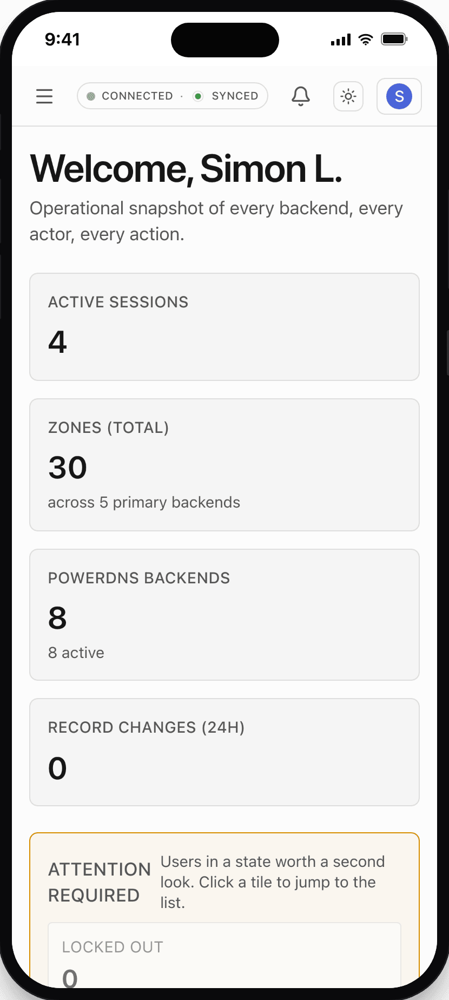
  </picture>
  &nbsp;
  <p align="center">
    <picture>
    <source media="(prefers-color-scheme: dark)" srcset="../screenshots/dark/zones-list-mobile.png" />
    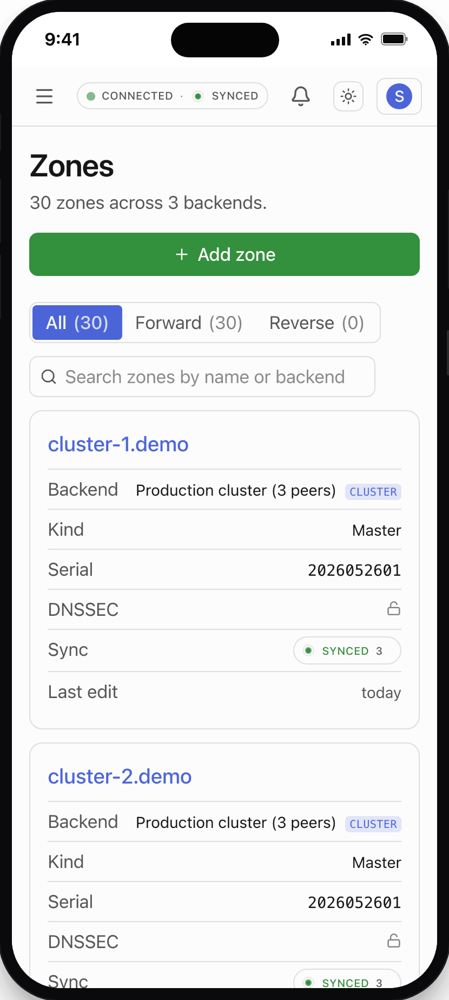
    </picture>
  </p>
</p>

### 19.2 One DataTable, every list

- **What.** Every list view (zones, users, roles, teams, authentication providers, TSIG keys,
  autoprimaries, zone templates, audit log, PDNS request log, sessions, profile sessions,
  servers, dashboard sub-tables, role assignments, team members, zone change history) uses
  the same `<DataTable>` recipe. Desktop: `bg-bg-muted` thead, `even:bg-bg-subtle` striping,
  accent-tinted hover wash, sticky search + sort + per-column meta widths. Mobile (< md):
  each row reflows to a labelled card automatically - no horizontal scroll, no truncated
  cells.
- **Where.** `components/ui/data-table.tsx`. The Audit Log + Profile Sessions + OIDC
  Providers + TSIG Keys + Autoprimaries were the final hold-outs converted in v1.1.4.

### 19.3 Live header status chip

- **What.** Single pill in the top bar showing `CONNECTING / CONNECTED / OFFLINE / PAUSED`
  (SSE connection state) plus a trailing `· SYNCED / · DESYNCED` whenever the page has a
  notion of sync state. Off-the-shelf default is the fleet-wide `globalAnyLagging()` verdict
  computed from the in-process zone-state cache (no extra PDNS hit); per-page
  `<HeaderStatusMode/>` overrides on zone-detail, zones-list, and the servers page. A 5 s
  grace prevents "OFFLINE" flashes on Ctrl-R.
- **Where.** `components/realtime/header-status-chip.tsx`,
  `components/realtime/realtime-provider.tsx`, `lib/pdns/sync.ts` (`globalAnyLagging`).

### 19.4 Animated SyncIndicator

- **What.** Concentric-ring SVG glyph used everywhere a sync verdict is displayed (header
  chip, zones list per-row chip, servers table). **Synced** = solid centre + two
  outward-pulsing rings via staggered CSS keyframes - a continuous radar/sonar ping.
  **Desynced** = hollow centre + two dashed concentric rings that counter-rotate via
  `stroke-dashoffset` so the icon reads as _actively trying_ rather than as a frozen error.
  Honours `prefers-reduced-motion`.
- **Where.** `components/ui/sync-indicator.tsx`, `app/globals.css` (`pda-sync-pulse` +
  `pda-desync-spin*` keyframes).

### 19.5 One-button theme toggle

- **What.** Was three buttons (sun / monitor / moon). Now one button whose icon mirrors the
  active preference and cycles `light → dark → system → light` on click. The pre-hydration
  script in `app/layout.tsx` still applies the `.dark` class before React mounts so there's
  no flash of wrong theme.
- **Where.** `components/ui/theme-toggle.tsx`.

### 19.6 Capability badges + clickable rows

- **What.** Per-backend badges (`CLUSTER` / `DEFAULT` / `PRIMARY` / `READ-ONLY MIRROR`) match
  the visual vocabulary across servers, zones, audit. Every table row + mobile card is
  clickable to the detail view; embedded links/buttons (Edit / Delete / Refresh) intercept the
  click so per-row actions still work.
- **Where.** `components/domain/capability-badges.tsx`, `components/ui/clickable-row.tsx`.

### 19.7 Diff-before-apply (record edits)

The per-RRset editor now insists on a **Review changes** modal between Save and the actual
PATCH - see [§ 4.2](#42-per-rrset-editor-with-diff-before-apply) for the full story. Validation
errors are gated behind an explicit "Save anyway" checkbox so an override is never accidental.

### 19.8 Inline record editing

- **What.** Enter on a row, a double-click, or the row's **Edit** button opens an edit strip
  directly beneath the record: TTL, value (the same structured MX / SRV / CAA / TXT editors
  the dialog uses) and the disabled flag. Enter stages the change, Esc backs out. Anything
  that would move the record to a different RRset - name, type, comment - escalates to the
  full dialog via **Full editor…** (or `E` on the row), carrying the in-progress draft along.
  Both paths stage through the same code and land in the same **Review changes** diff
  (§ 19.7), so there is one route to PowerDNS whichever editor the operator used.
- **Where.** `app/(app)/zones/[zoneId]/_components/editable-record-table.tsx`
  (`InlineRecordEditor`, `stageDraft`); row hooks via `DataTable`'s `getRowProps`.

### 19.9 Keyboard model

- **What.** The records table is fully drivable without a mouse: `/` focuses search (Esc
  clears it, Esc again leaves it), `N` opens Add record, `↑`/`↓` move between rows,
  `Enter` edits in place, `E` opens the full editor, `Delete` deletes. The editor and review
  dialogs are real forms - Enter reviews, Enter again saves, Esc steps back one level. A
  legend under the table lists the keys.
- **Selects are combo boxes.** `<SelectMenu>` follows the native `<select>` habits: on a
  closed menu `T` picks TXT, `T` again TLSA, `TL` TLSA directly; `↑`/`↓`/Home/End/PgUp/PgDn
  move the highlight, Enter or Space picks, Esc closes just the menu (the dialog around it
  stays open). Lists of ten or more options get a filter box that matches label _and_
  description, so `ipv6` finds AAAA and `mail` finds MX. The record-type menu shows each
  type's plain-English name as the second line.
- **Where.** `components/ui/select-menu.tsx` (+ `select-menu-keys.ts`, unit-tested),
  `components/ui/data-table.tsx` (`searchShortcut`, `getRowProps`).

### 19.10 Compliance hard-stops

- **What.** Operators with `must_change_password = true` or unmet MFA-per-role requirements
  are pinned to `/profile` (or an allow-list of self-service routes) on every navigation -
  not just the initial render. The header status chip is suppressed in that state because
  the SSE endpoint would 403 the request, which would otherwise leave the chip stuck on
  `CONNECTING`.
- **Where.** `lib/auth/require-user.ts` (page gate), `app/(app)/layout.tsx` (compliance
  redirect), `components/auth/compliance-guard.tsx` (client-side intercept).
