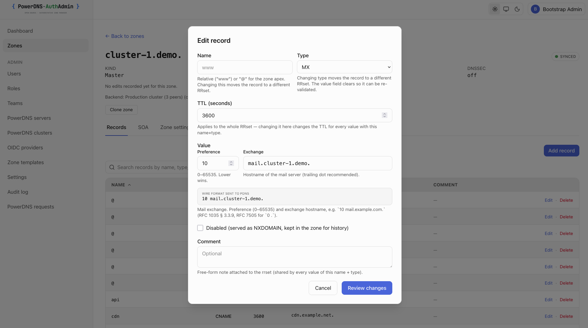
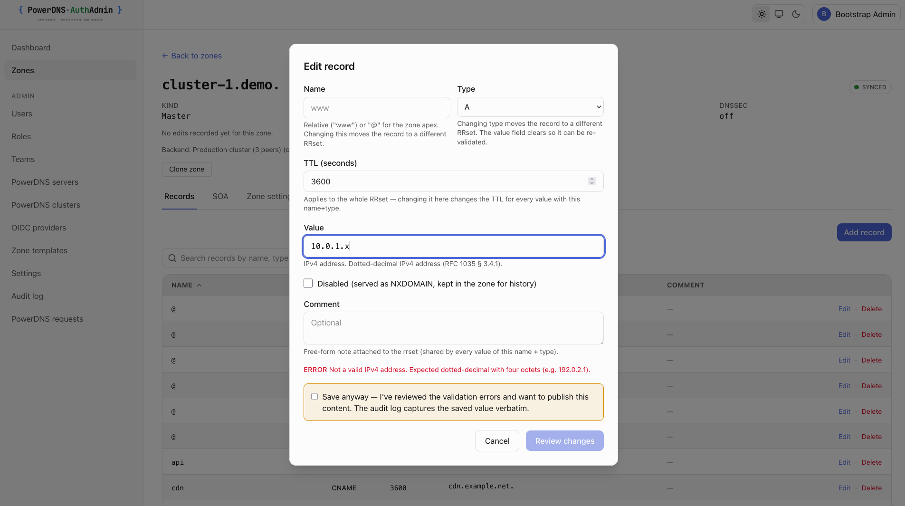
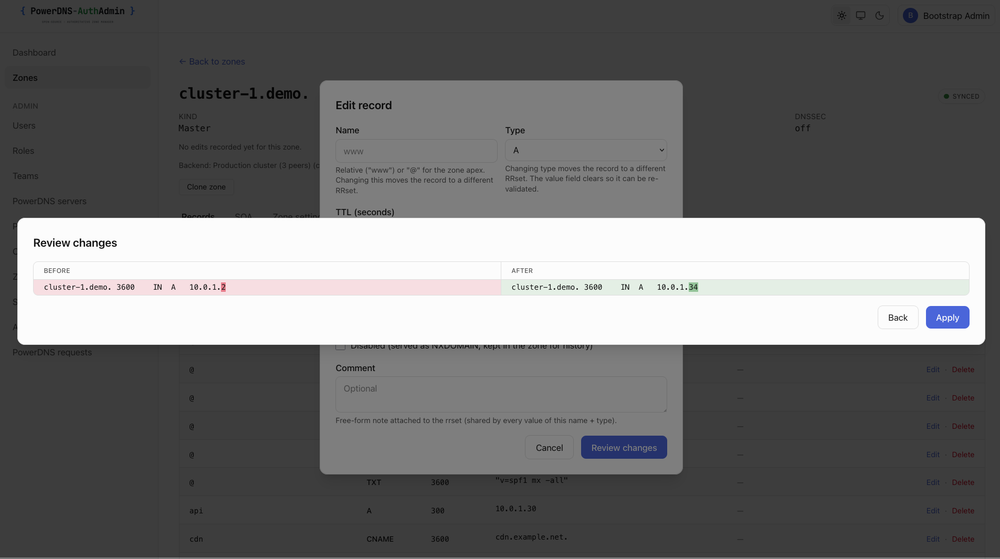
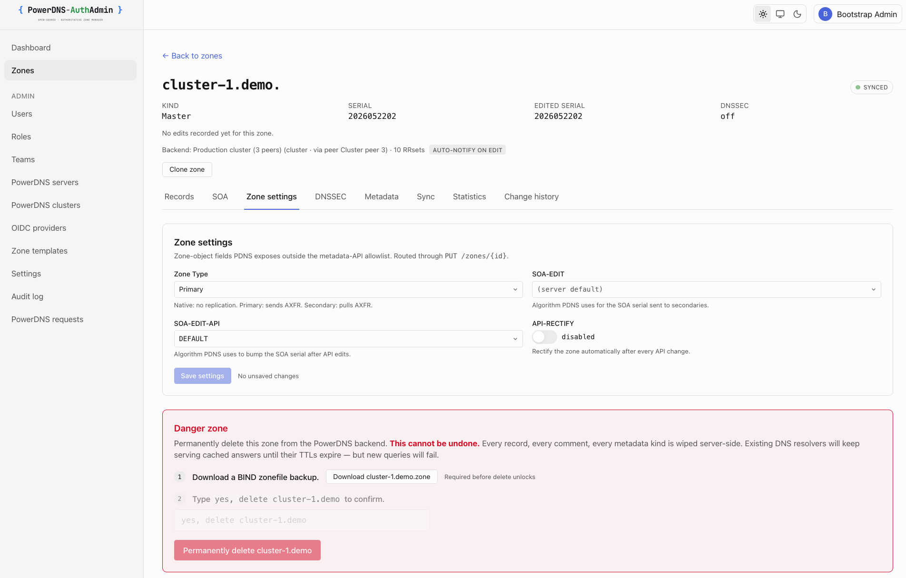
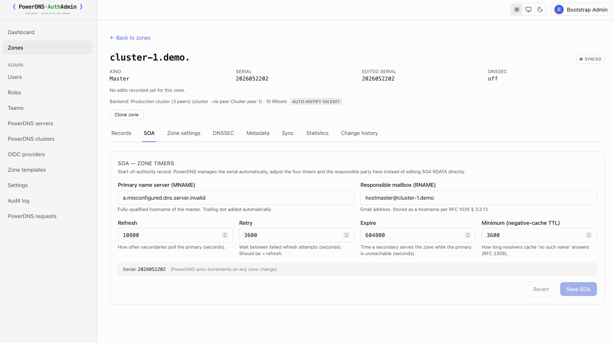
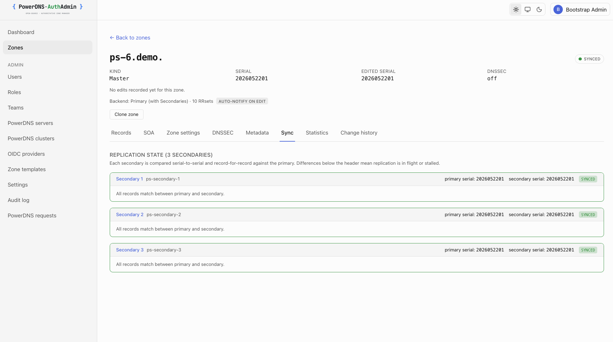
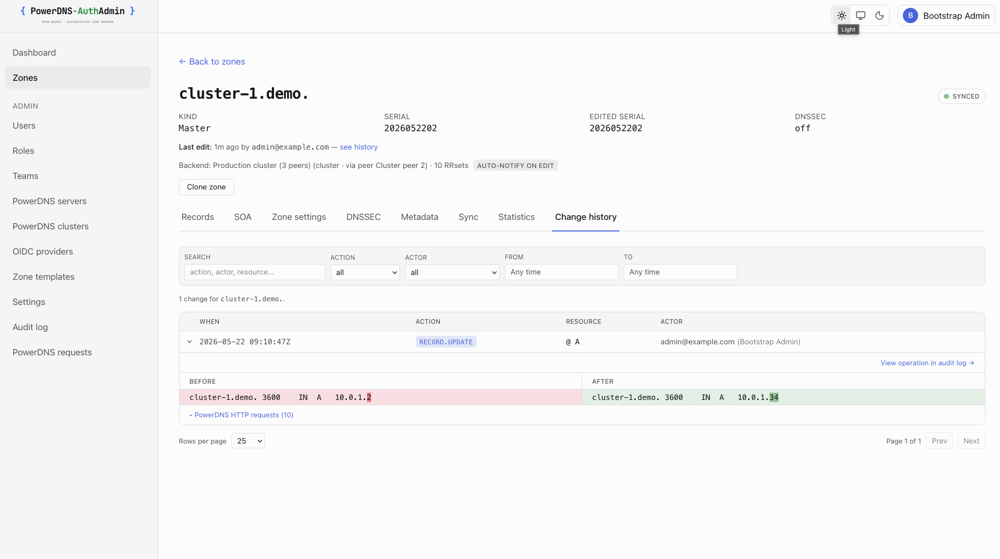
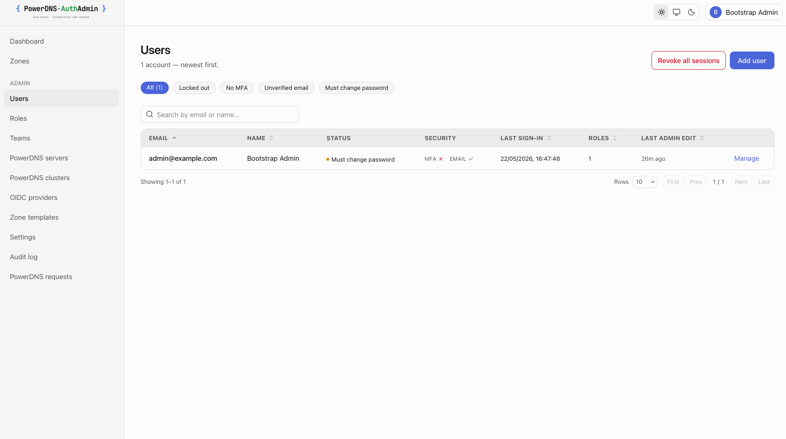

# Screenshots

A visual tour of **PowerDNS-AuthAdmin**. Each shot has a **light** and **dark** variant
(`light/<name>.png` + `dark/<name>.png`); the images below auto-switch to match your GitHub theme.
Back to the [project README](../README.md).

## Dashboard

Operational snapshot of every backend — active sessions, zone/backend counts, an "attention
required" surface (locked-out, no-MFA, unverified-email, must-change-password), and live PowerDNS
statistics (query rate, latency, cache hit ratio, response composition) polled from every primary
and secondary.

<picture><source media="(prefers-color-scheme: dark)" srcset="./dark/dashboard.png" /></picture>

## Multi-backend — PowerDNS servers

Standalone primaries, primary + secondaries groups, and multi-primary cluster peers managed side by
side, each with reachability, version, and sync status.

<picture><source media="(prefers-color-scheme: dark)" srcset="./dark/powerdns-servers.png" /></picture>

## Zones

Every backend's zones amalgamated into one searchable list, with kind, serial, DNSSEC, and sync
state per zone.

<picture><source media="(prefers-color-scheme: dark)" srcset="./dark/zones-list.png" /></picture>

## Record editor

Per-RRset editor with per-type validation.

<picture><source media="(prefers-color-scheme: dark)" srcset="./dark/record-editor.png" /></picture>

<picture><source media="(prefers-color-scheme: dark)" srcset="./dark/record-edit-a.png" /></picture>

## Diff-before-apply

Every change is previewed as a before/after diff before it's written to PowerDNS.

<picture><source media="(prefers-color-scheme: dark)" srcset="./dark/record-diff.png" /></picture>

## Zone settings

Per-zone configuration — zone type, SOA-EDIT-API, BIND export, and a guarded danger zone.

<picture><source media="(prefers-color-scheme: dark)" srcset="./dark/zone-settings.png" /></picture>

## SOA & zone timers

Edit the SOA RNAME and the refresh / retry / expire / minimum timers directly.

<picture><source media="(prefers-color-scheme: dark)" srcset="./dark/soa-editor.png" /></picture>

## Sync probe

Replication state for a primary + secondaries group — each secondary's serial compared against the
primary, with a record-for-record diff on demand.

<picture><source media="(prefers-color-scheme: dark)" srcset="./dark/sync-secondaries.png" /></picture>

## Per-zone change history

The audit trail filtered to a single zone, with before/after diffs and the acting user.

<picture><source media="(prefers-color-scheme: dark)" srcset="./dark/zone-change-history.png" /></picture>

## RBAC — roles

Seeded system roles plus custom roles. System roles expose only the MFA-required toggle; custom
roles support full CRUD.

<picture><source media="(prefers-color-scheme: dark)" srcset="./dark/roles.png" /></picture>

## Users

User management with a per-mechanism security column (MFA, email verification), account status, and
last sign-in.

<picture><source media="(prefers-color-scheme: dark)" srcset="./dark/users.png" /></picture>

## Audit log

Append-only record of every state-changing action, filterable by action, actor, and resource, with
redacted before/after snapshots and CSV export.

<picture><source media="(prefers-color-scheme: dark)" srcset="./dark/audit-log.png" /></picture>
