# Screenshots

A visual tour of **PowerDNS-AuthAdmin**. Every page is captured at four
parities - **desktop + light**, **desktop + dark**, **mobile + light**,
**mobile + dark** - and rendered below with `<picture>` so the images
auto-switch to match your GitHub / browser theme. Mobile shots are
real screenshots wrapped in an iPhone 16 Pro bezel.

Regen with [`scripts/screenshots.mjs`](../scripts/screenshots.mjs) (see the
header comment for prereqs + env knobs). Each entry produces 4 PNGs:
`screenshots/<light|dark>/<name>{-mobile}.png`.

Back to the [project README](../README.md) · feature catalogue:
[`docs/FEATURES.md`](../docs/FEATURES.md) ·
the responsive overhaul behind these shots:
[Operator UX & responsive design](../docs/FEATURES.md#19-operator-ux--responsive-design).

---

## Dashboard

Operational landing page: active sessions, zone + backend totals, recent
record-change counts, an **Attention required** surface (locked-out, no
MFA, unverified, must-change-password) and live PowerDNS statistics
(query rate, latency, cache hit ratio, response composition) polled from
every primary and secondary.

<picture>
  <source media="(prefers-color-scheme: dark)" srcset="./dark/dashboard.png" />
  
</picture>

  <picture>
  <source media="(prefers-color-scheme: dark)" srcset="./dark/dashboard-mobile.png" />
  
  </picture>

→ [Dashboard feature notes](../docs/FEATURES.md#11-dashboard)

---

## Backend health · alert bell

The bell in the top-right surfaces active **backend advisories** -
unreachable hosts, API-key rejections, replication drift, missing TSIG
keys, config drift between peers. One click reveals the popover with
acknowledge + jump-to-source actions; cleared advisories disappear
automatically.

<picture>
  <source media="(prefers-color-scheme: dark)" srcset="./dark/backend-health.png" />
  
</picture>

  <picture>
  <source media="(prefers-color-scheme: dark)" srcset="./dark/backend-health-mobile.png" />
  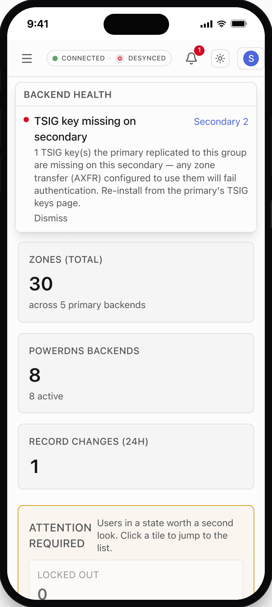
  </picture>

→ [Backend health advisories](../docs/FEATURES.md#37-backend-health-advisories)
· [ADR-0015](../docs/adr/0015-backend-health-advisories.md)

---

## Zones - amalgamated list

Every backend's zones merged into one searchable list, with kind, serial,
DNSSEC status, last-edit timestamp, and a **per-row sync chip** showing
whether all peers (secondaries or cluster members) are serving the same
view. Live-updates over SSE; sort/filter/paginate client-side.

<picture>
  <source media="(prefers-color-scheme: dark)" srcset="./dark/zones-list.png" />
  
</picture>

  <picture>
  <source media="(prefers-color-scheme: dark)" srcset="./dark/zones-list-mobile.png" />
  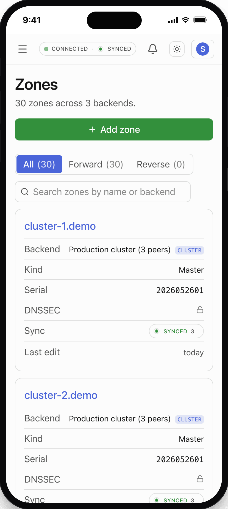
  </picture>

→ [Amalgamated zones list](../docs/FEATURES.md#41-amalgamated-zones-list)
· [Sync probes](../docs/FEATURES.md#33-sync-probes)

---

## Zone detail

Per-zone landing: kind / serial / DNSSEC status; last-edit attribution;
backend (with cluster + RRset count); Clone-zone button; tabs for
**Records**, **SOA**, **Zone settings**, **DNSSEC**, **Change history**.
The records table groups records by RRset and surfaces type / TTL /
value / comment in a per-row editor.

<picture>
  <source media="(prefers-color-scheme: dark)" srcset="./dark/zone-detail.png" />
  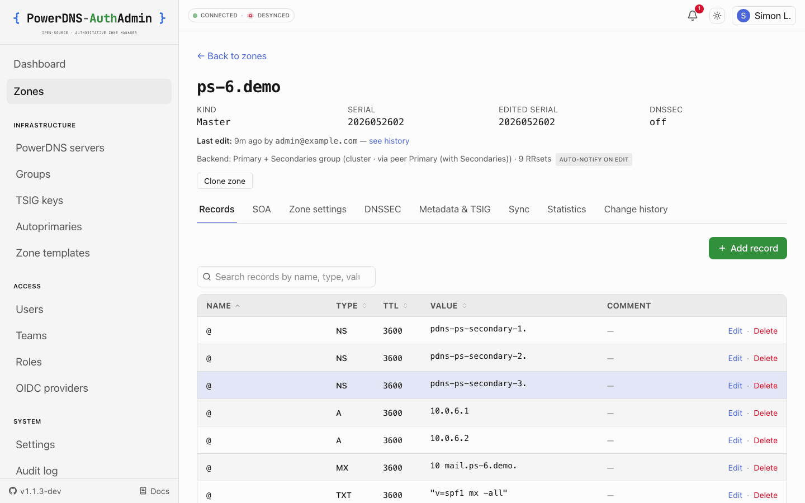
</picture>

  <picture>
  <source media="(prefers-color-scheme: dark)" srcset="./dark/zone-detail-mobile.png" />
  
  </picture>

→ [Per-RRset editor](../docs/FEATURES.md#42-per-rrset-editor-with-diff-before-apply)
· [Per-RRset optimistic concurrency (ADR-0010)](../docs/adr/0010-per-rrset-optimistic-concurrency.md)

---

## Edit record dialog

Click **Edit** on any row to open the per-RRset editor. Per-type
structured editors for SRV/MX/CAA/NAPTR/SVCB/TLSA/SSHFP/URI/DS/TXT;
ASCII fallback for everything else. Inline validation surfaces problems
as you type; the **Save anyway** override is gated behind an explicit
checkbox so risky edits are intentional, not accidental.

<picture>
  <source media="(prefers-color-scheme: dark)" srcset="./dark/zone-edit.png" />
  
</picture>

  <picture>
  <source media="(prefers-color-scheme: dark)" srcset="./dark/zone-edit-mobile.png" />
  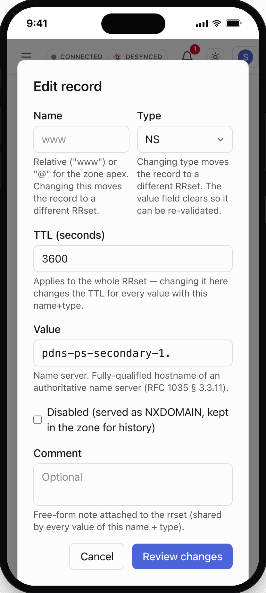
  </picture>

→ [Diff-before-apply editor](../docs/FEATURES.md#42-per-rrset-editor-with-diff-before-apply)

---

## Review changes - diff before apply

Every record change is previewed as a BIND-style **before / after diff**
before it's written. The Save button stays disabled until the operator
confirms - no accidental mutations, full audit trail (the diff is what
lands in [Audit log](#audit-log)).

<picture>
  <source media="(prefers-color-scheme: dark)" srcset="./dark/zone-edit-diff.png" />
  
</picture>

  <picture>
  <source media="(prefers-color-scheme: dark)" srcset="./dark/zone-edit-diff-mobile.png" />
  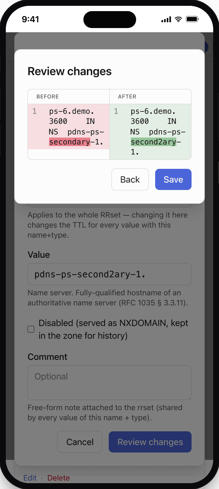
  </picture>

→ [Per-RRset optimistic concurrency (ADR-0010)](../docs/adr/0010-per-rrset-optimistic-concurrency.md)

---

## Zone change history

The audit log filtered to a single zone, with before / after diffs, the
acting user, and a request-id deep-link to every related audit row
(NOTIFY, PDNS HTTP traffic, etc.). Filters: search, action, actor,
date range; click any row to reveal the full diff in place.

<picture>
  <source media="(prefers-color-scheme: dark)" srcset="./dark/zone-change-history.png" />
  
</picture>

  <picture>
  <source media="(prefers-color-scheme: dark)" srcset="./dark/zone-change-history-mobile.png" />
  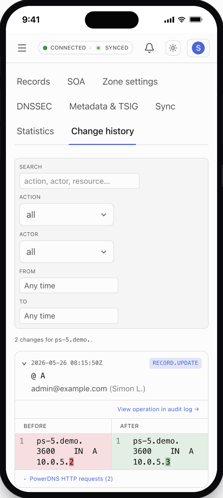
  </picture>

→ [Zone change history](../docs/FEATURES.md#45-zone-change-history)

---

## PowerDNS servers

One row per backend, grouped by topology: **standalone primaries**,
**primary + secondaries** groups, and **multi-primary cluster** peers.
Each row carries reachability, version, sync status, and a Test button
that re-probes on demand. Secondaries nest under their primary via
explicit group membership **or** poller-derived topology.

<picture>
  <source media="(prefers-color-scheme: dark)" srcset="./dark/powerdns-servers.png" />
  
</picture>

  <picture>
  <source media="(prefers-color-scheme: dark)" srcset="./dark/powerdns-servers-mobile.png" />
  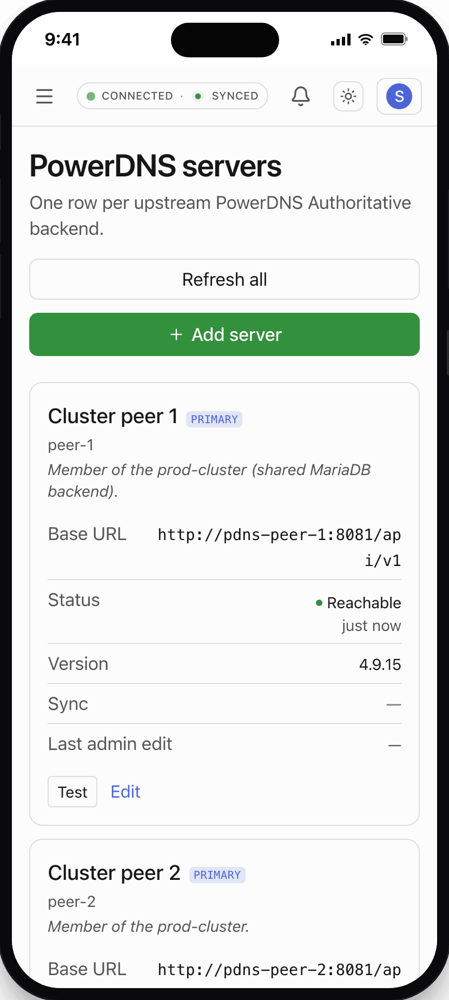
  </picture>

→ [Multi-backend management](../docs/FEATURES.md#31-multi-backend-management)
· [Backend capability model (ADR-0014)](../docs/adr/0014-backend-capability-model.md)
· [Backends doc](../docs/04-BACKENDS.md)

---

## Users

User management - security column per mechanism (TOTP, email
verification), account status, last sign-in. Per-user detail page
manages role assignments (global / team-scoped / server-scoped),
MFA enrolment, password reset, and active sessions.

<picture>
  <source media="(prefers-color-scheme: dark)" srcset="./dark/users.png" />
  
</picture>

  <picture>
  <source media="(prefers-color-scheme: dark)" srcset="./dark/users-mobile.png" />
  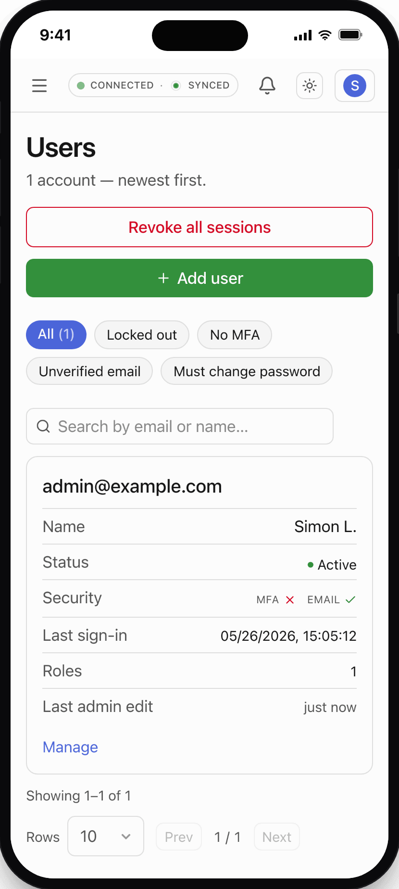
  </picture>

→ [Authentication](../docs/FEATURES.md#1-authentication)
· [Sessions](../docs/FEATURES.md#16-sessions)

---

## Teams

Team-scoped grouping for RBAC. A user joins a team as `member` or
`owner`; team-scoped role assignments grant permissions only within
the team's resources.

<picture>
  <source media="(prefers-color-scheme: dark)" srcset="./dark/teams.png" />
  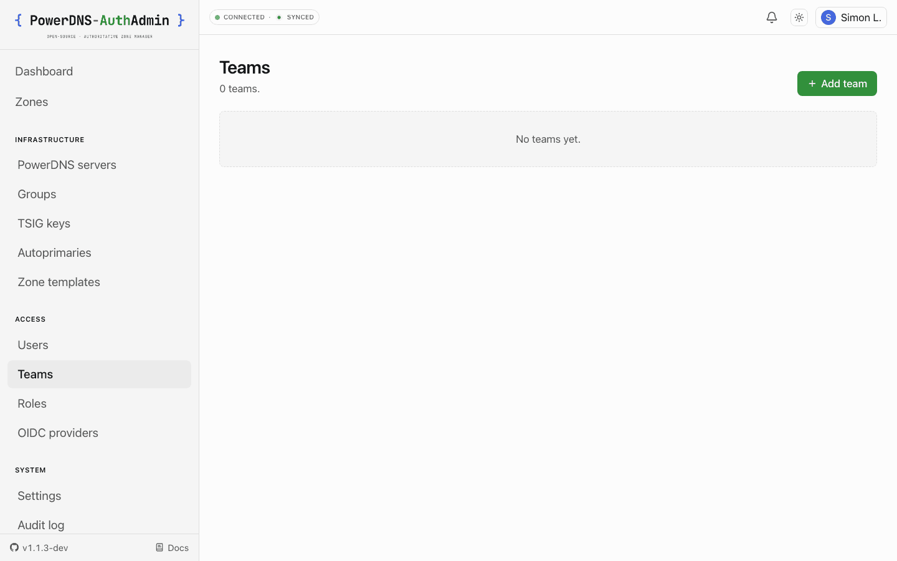
</picture>

  <picture>
  <source media="(prefers-color-scheme: dark)" srcset="./dark/teams-mobile.png" />
  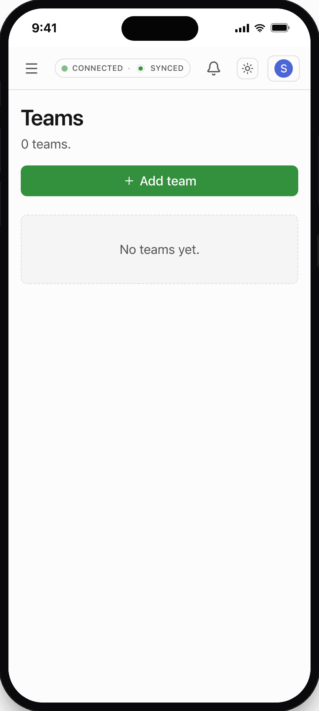
  </picture>

→ [Scoped assignments](../docs/FEATURES.md#23-scoped-assignments)

---

## Roles

Seeded **system** roles (read-only / operator / admin) plus your own
**custom** roles. System roles expose only the require-MFA toggle;
custom roles open the full permission grid (CRUD across zones, records,
backends, users, teams, audit, settings, OIDC, TSIG, autoprimaries,
templates).

<picture>
  <source media="(prefers-color-scheme: dark)" srcset="./dark/roles.png" />
  
</picture>

  <picture>
  <source media="(prefers-color-scheme: dark)" srcset="./dark/roles-mobile.png" />
  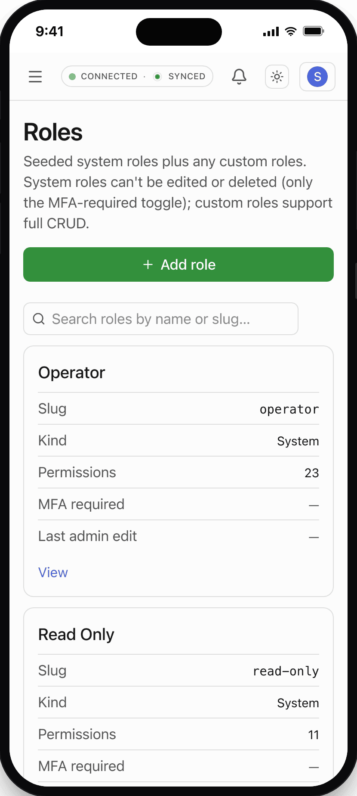
  </picture>

→ [Permissions vocabulary](../docs/FEATURES.md#21-permissions-vocabulary)
· [System + custom roles](../docs/FEATURES.md#22-system--custom-roles)
· [RBAC doc](../docs/07-RBAC.md)

---

## Audit log

Append-only record of every state-changing action. Filterable by actor,
action, resource, date range; before / after snapshots redacted for
known secret fields; per-row PDNS HTTP-call log; CSV export. Quick-
filter chips for incident-response shortcuts (failed sign-ins, MFA
admin changes, session revocations).

<picture>
  <source media="(prefers-color-scheme: dark)" srcset="./dark/audit-log.png" />
  
</picture>

  <picture>
  <source media="(prefers-color-scheme: dark)" srcset="./dark/audit-log-mobile.png" />
  
  </picture>

→ [Audit log](../docs/FEATURES.md#9-audit-log)

---

## PDNS request log

Every HTTP call the app makes to PowerDNS, recorded with method, URL,
status, error, request body, and the audit `requestId` that triggered
it. Inline expandable HTTP detail (request + response) - useful when an
audit row points at a PDNS failure and you need the raw exchange.

<picture>
  <source media="(prefers-color-scheme: dark)" srcset="./dark/pdns-requests.png" />
  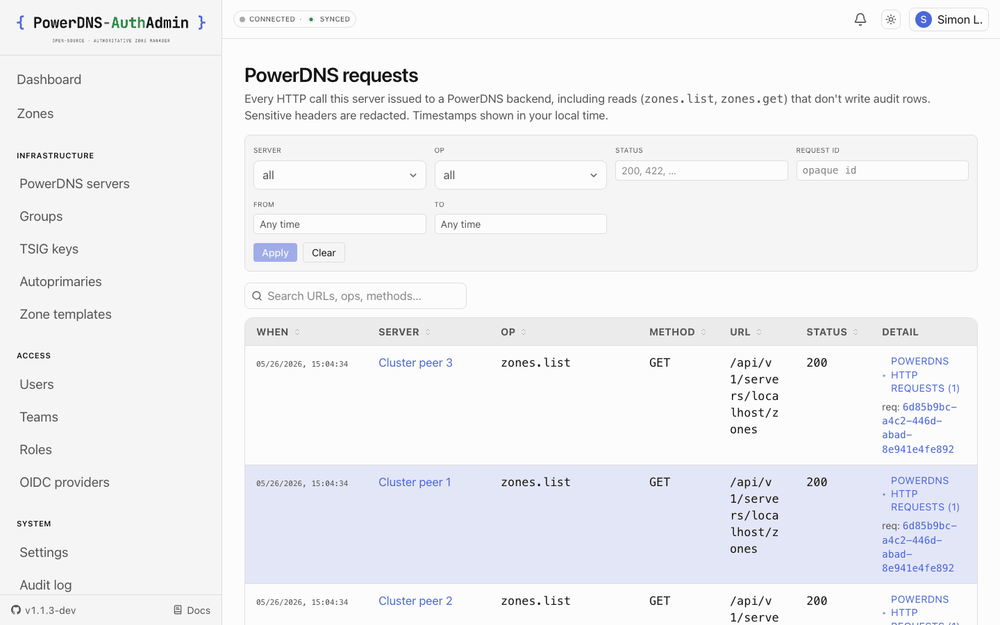
</picture>

  <picture>
  <source media="(prefers-color-scheme: dark)" srcset="./dark/pdns-requests-mobile.png" />
  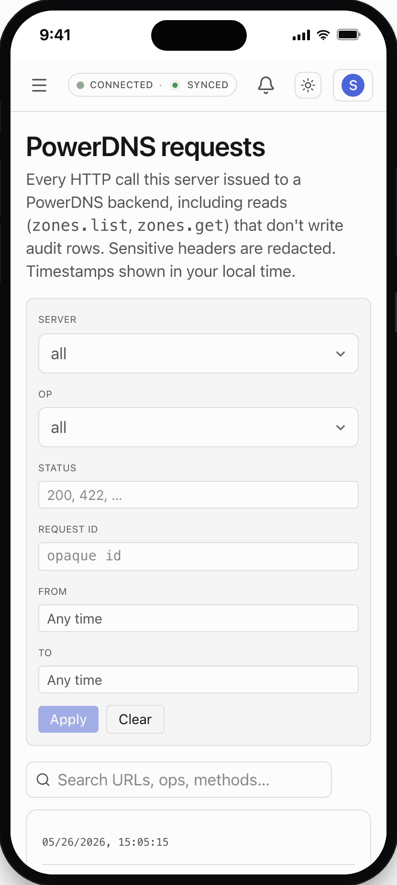
  </picture>

→ [PDNS request log](../docs/FEATURES.md#36-pdns-request-log)
· [PDNS HTTP client](../docs/FEATURES.md#35-pdns-http-client)

---

## OIDC providers

Identity providers that show up on the sign-in page. Each provider's
discovery cache is probed in the background; the row turns red if
discovery fails. The env-configured provider (`OIDC_*`) is folded into
the same table badged **Configured by ENV** so it isn't a hidden
fallback. Per-provider email-domain allow-lists, group → role mapping,
and a one-click Test discovery probe.

<picture>
  <source media="(prefers-color-scheme: dark)" srcset="./dark/oidc-providers.png" />
  
</picture>

  <picture>
  <source media="(prefers-color-scheme: dark)" srcset="./dark/oidc-providers-mobile.png" />
  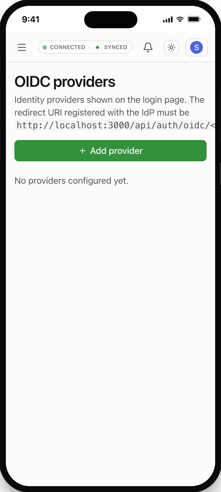
  </picture>

→ [OIDC SSO](../docs/FEATURES.md#12-oidc-sso)
· [Group → role mapping](../docs/FEATURES.md#13-group--role-mapping-oidc)
· [OIDC doc](../docs/05-OIDC.md)

---

## TSIG keys

Per-backend inventory of TSIG keys - name + algorithm only (never the
shared secret). The wizard walks operators through generate → install
on peer secondaries → activate for zones, in one flow.

<picture>
  <source media="(prefers-color-scheme: dark)" srcset="./dark/tsig-keys.png" />
  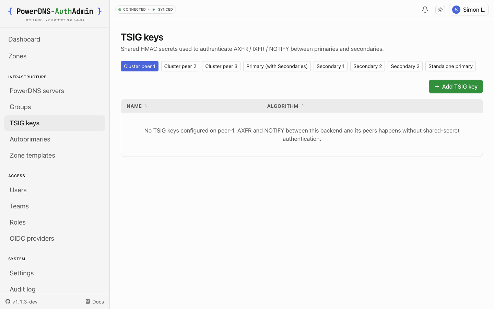
</picture>

  <picture>
  <source media="(prefers-color-scheme: dark)" srcset="./dark/tsig-keys-mobile.png" />
  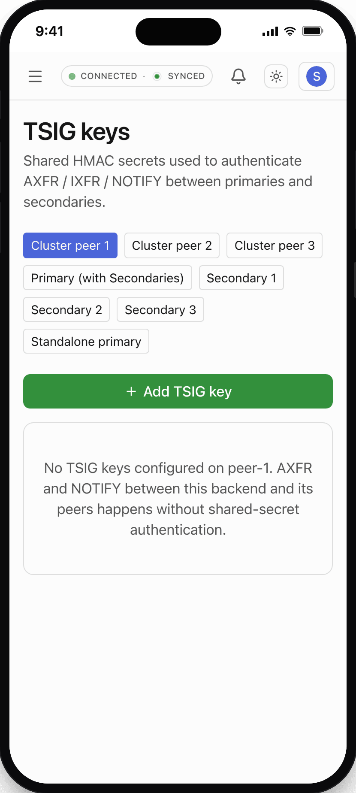
  </picture>

→ [TSIG keys](../docs/FEATURES.md#7-tsig-keys)

---

## Autoprimaries

Per-backend `(ip, nameserver, account)` tuples PDNS accepts NOTIFYs
from for auto-creation of secondary zones.

<picture>
  <source media="(prefers-color-scheme: dark)" srcset="./dark/autoprimaries.png" />
  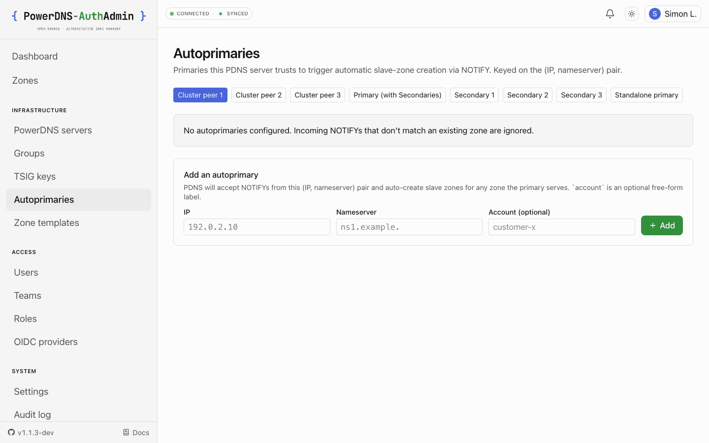
</picture>

  <picture>
  <source media="(prefers-color-scheme: dark)" srcset="./dark/autoprimaries-mobile.png" />
  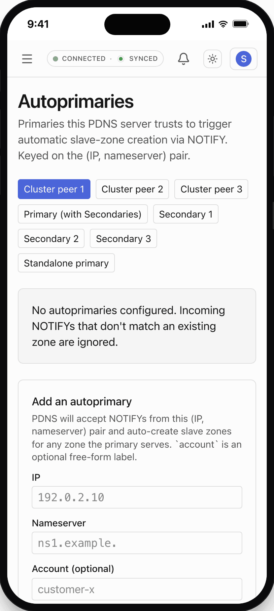
  </picture>

→ [Autoprimaries](../docs/FEATURES.md#8-autoprimaries)

---

## Zone templates

Reusable record-set bundles applied to new zones at create-time or to
existing zones in-place. Parameterised by zone name (and operator-
supplied vars) - turn a 30-row apex/MX/SPF/DKIM/DMARC bundle into a
one-click apply.

<picture>
  <source media="(prefers-color-scheme: dark)" srcset="./dark/zone-templates.png" />
  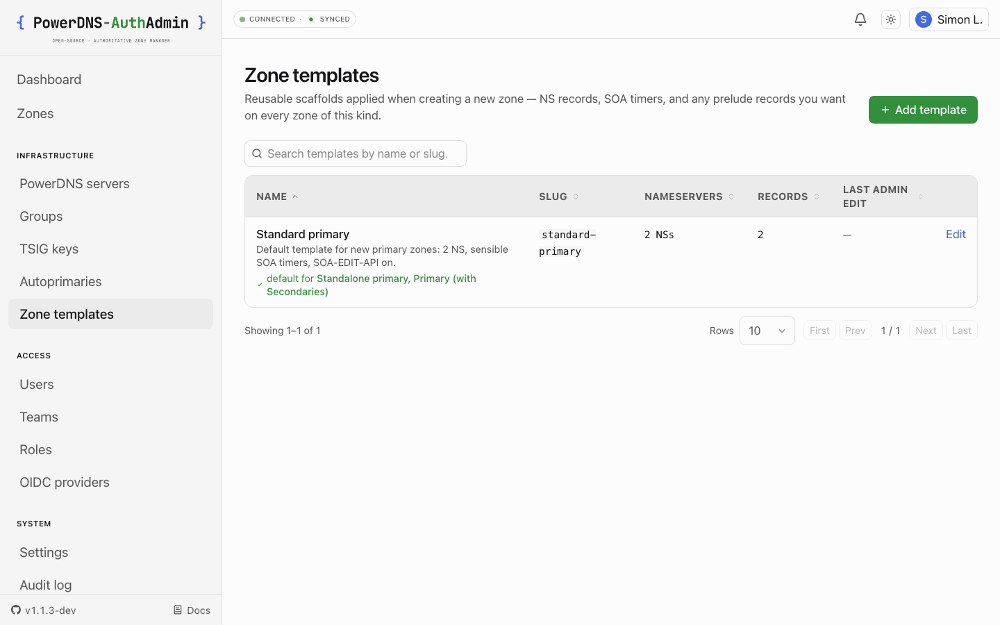
</picture>

  <picture>
  <source media="(prefers-color-scheme: dark)" srcset="./dark/zone-templates-mobile.png" />
  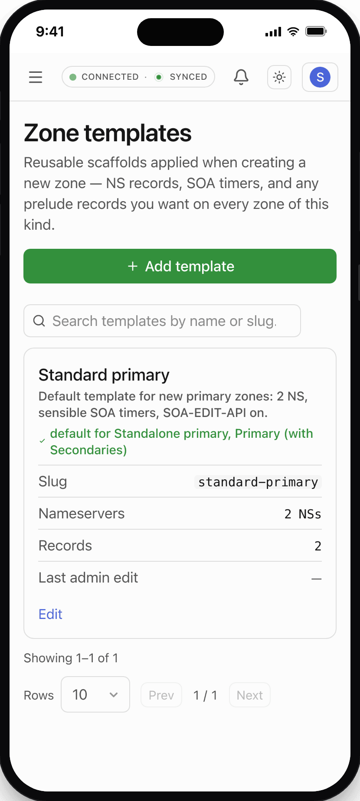
  </picture>

→ [Zone templates](../docs/FEATURES.md#44-zone-templates)

---

## Settings

Site-wide configuration - display name, brand logo, signup policy,
operator-visible email defaults, rate-limit knobs. Everything writable
from the UI is also reachable through the first-boot YAML provisioner
so a fresh deploy lands on the same configuration each time.

<picture>
  <source media="(prefers-color-scheme: dark)" srcset="./dark/settings.png" />
  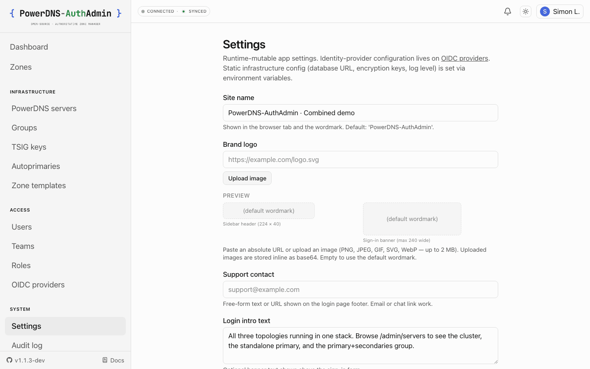
</picture>

  <picture>
  <source media="(prefers-color-scheme: dark)" srcset="./dark/settings-mobile.png" />
  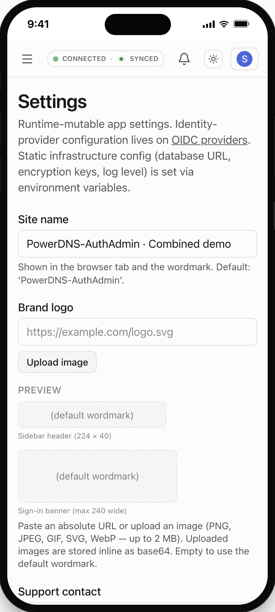
  </picture>

→ [Settings](../docs/FEATURES.md#10-settings)
· [Provisioning](../docs/FEATURES.md#12-provisioning-first-boot-yaml)
· [Provisioning doc](../docs/06-PROVISIONING.md)

---

## Profile

Self-service account page: change password, enrol / remove TOTP,
manage active sessions (with revoke), generate scoped API tokens.
A forced-password user lands here automatically until they rotate.

<picture>
  <source media="(prefers-color-scheme: dark)" srcset="./dark/profile.png" />
  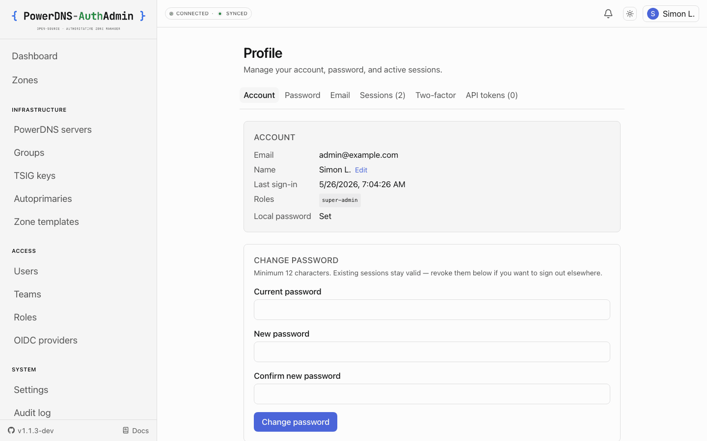
</picture>

  <picture>
  <source media="(prefers-color-scheme: dark)" srcset="./dark/profile-mobile.png" />
  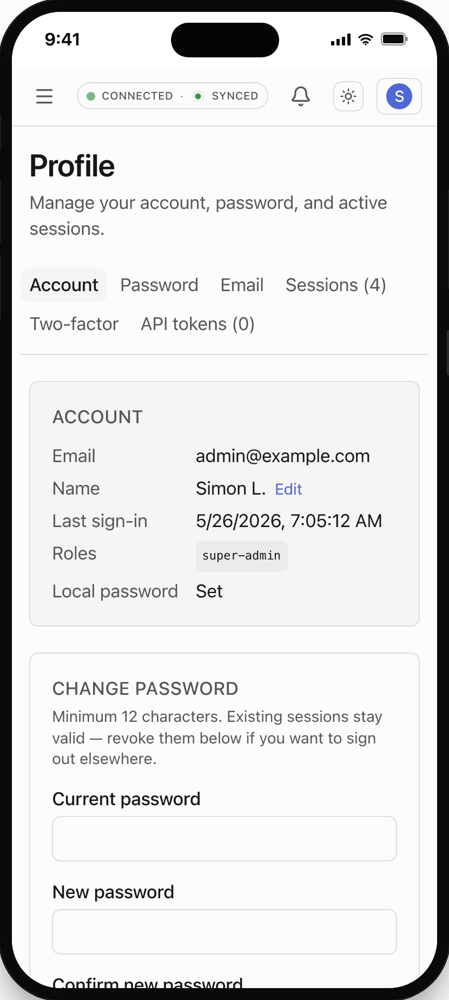
  </picture>

→ [TOTP (multi-factor)](../docs/FEATURES.md#14-totp-multi-factor)
· [API tokens](../docs/FEATURES.md#15-api-tokens)
· [Sessions](../docs/FEATURES.md#16-sessions)
